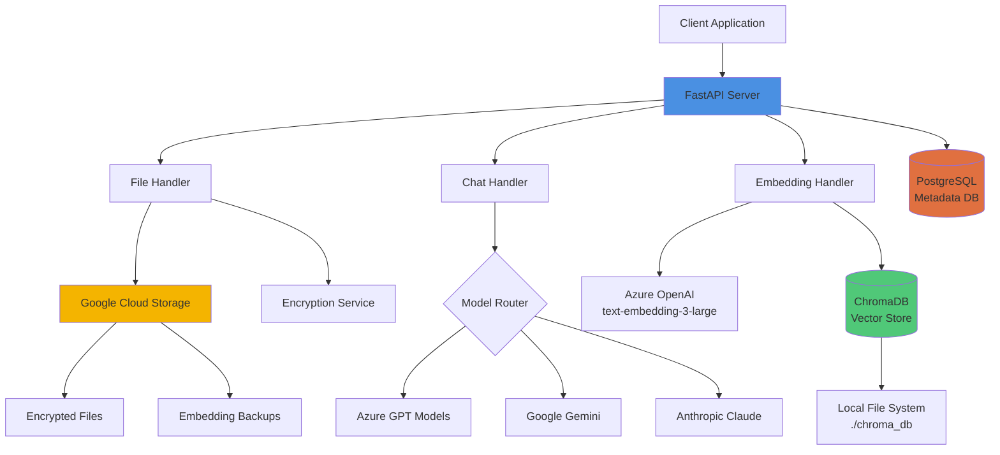
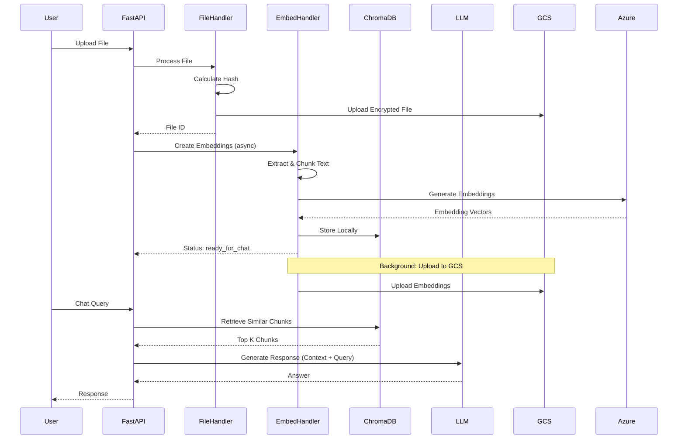
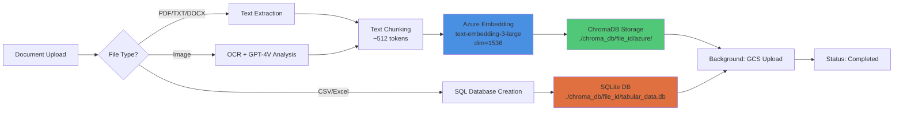
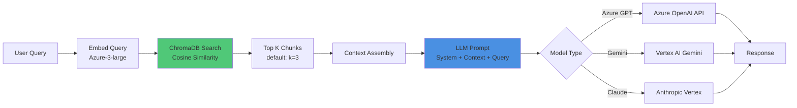
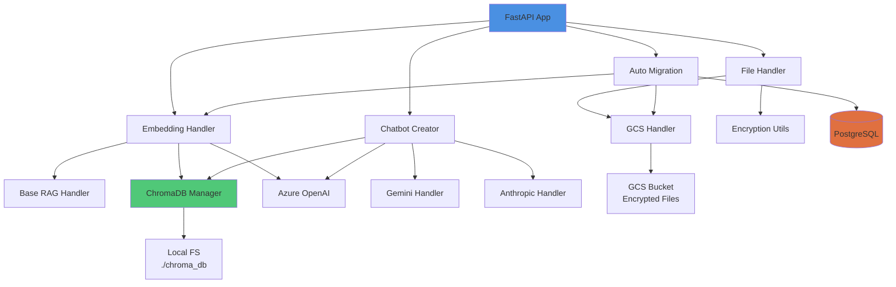
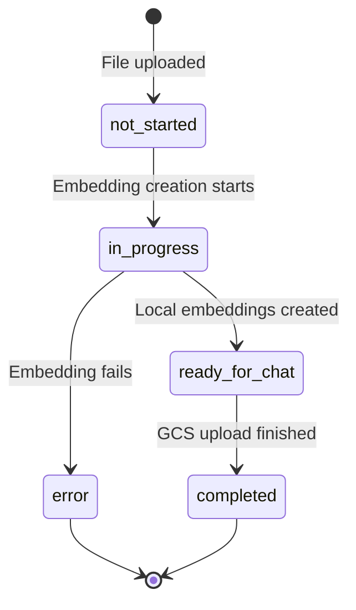

# RAG PDF API - Project Knowledge Base

**Version:** 3.1.0  
**Last Updated:** November 2025  
**Status:** Production  

---

## Table of Contents

1. [High-Level System Overview](#1-high-level-system-overview)
   - [Architecture Description](#architecture-description)
   - [Chatbot Flow](#chatbot-flow)
   - [RAG Pipeline Overview](#rag-pipeline-overview)
   - [Component Interactions](#component-interactions)
2. [Repository Structure](#2-repository-structure)
   - [Directory Tree](#directory-tree)
   - [Key Files and Their Purposes](#key-files-and-their-purposes)
   - [Configuration Files](#configuration-files)
3. [Environment & Setup](#3-environment--setup)
   - [Local Development Setup](#local-development-setup)
   - [Environment Variables](#environment-variables)
   - [Dependency Management](#dependency-management)
   - [Running, Testing, and Debugging](#running-testing-and-debugging)
4. [RAG Specification](#4-rag-specification)
   - [Data Ingestion Rules](#data-ingestion-rules)
   - [Chunking Strategy](#chunking-strategy)
   - [Embedding Model](#embedding-model)
   - [Vector Database Schema](#vector-database-schema)
   - [Retrieval Parameters](#retrieval-parameters)
   - [Updating and Rebuilding Knowledge Base](#updating-and-rebuilding-knowledge-base)
5. [Coding Guidelines](#5-coding-guidelines)
   - [Naming Conventions](#naming-conventions)
   - [Project Patterns to Follow](#project-patterns-to-follow)
   - [Anti-Patterns to Avoid](#anti-patterns-to-avoid)
   - [Testing Strategy](#testing-strategy)
   - [Logging and Error Handling](#logging-and-error-handling)
6. [AI Assistant Instructions](#6-ai-assistant-instructions)
   - [Context AI Must Always Consider](#context-ai-must-always-consider)
   - [Rules for Generating Code](#rules-for-generating-code)
   - [Project Constraints](#project-constraints)
   - [File Naming and Organization](#file-naming-and-organization)
   - [How to Propose Modifications Safely](#how-to-propose-modifications-safely)

---

## 1. High-Level System Overview

### Architecture Description

The RAG PDF API is a **FastAPI-based microservice** that implements a sophisticated Retrieval-Augmented Generation (RAG) system for processing and querying documents, images, and tabular data. The system employs a **unified embedding approach** where all language models (Azure OpenAI, Google Gemini, Anthropic Claude) query the same Azure-3-large embeddings.

#### Core Technologies

- **Backend Framework**: FastAPI 0.109.0+ with Pydantic for data validation
- **Language Models**:
  - Azure OpenAI (GPT-4, GPT-3.5, GPT-4o-mini)
  - Google Gemini (2.5-flash, 2.5-pro)
  - Anthropic Claude (Sonnet 4, Sonnet 4.5)
- **Vector Database**: ChromaDB with persistent storage and thread-local instances
- **Cloud Storage**: Google Cloud Storage (GCS) with encryption
- **Metadata Database**: PostgreSQL for file hash lookup and metadata
- **Image Generation**: DALL-E 3, Vertex AI Imagen, NanoBanana
- **Document Processing**: PyPDF2, pdfminer-six, pdf2image, pytesseract
- **Tabular Processing**: Pandas, SQLAlchemy for SQL-based querying

#### System Architecture Diagram



### Chatbot Flow

The chatbot request flow is optimized for **low latency** and **high concurrency**:



#### Key Flow Characteristics

1. **Parallel File Processing**: Up to 10 files processed concurrently
2. **Decoupled Embeddings**: Local embeddings created first → immediate chat availability
3. **Background Uploads**: GCS uploads happen asynchronously after chat is ready
4. **Auto-Migration**: Legacy embeddings automatically upgraded on access
5. **Multi-File Support**: Single query across multiple documents

### RAG Pipeline Overview

#### Document Processing Pipeline



#### Retrieval Flow



### Component Interactions

#### Core Components

| Component | Responsibility | Key Files |
|-----------|---------------|-----------|
| **FastAPI App** | HTTP endpoints, request routing | [`app.py`](rtl_rag_chatbot_api/app.py:1) |
| **File Handler** | File upload, encryption, hash calculation | [`file_handler.py`](rtl_rag_chatbot_api/chatbot/file_handler.py:1) |
| **Embedding Handler** | Embedding creation, parallel processing | [`embedding_handler.py`](rtl_rag_chatbot_api/chatbot/embedding_handler.py:1) |
| **GCS Handler** | Cloud storage operations | [`gcs_handler.py`](rtl_rag_chatbot_api/chatbot/gcs_handler.py:1) |
| **Chatbot Creator** | RAG query execution | [`chatbot_creator.py`](rtl_rag_chatbot_api/chatbot/chatbot_creator.py:1) |
| **ChromaDB Manager** | Vector DB lifecycle, thread-safety | [`chroma_manager.py`](rtl_rag_chatbot_api/common/chroma_manager.py:1) |
| **Auto Migration Service** | Legacy embedding migration | [`auto_migration_service.py`](rtl_rag_chatbot_api/chatbot/auto_migration_service.py:1) |
| **Error Registry** | Structured error handling | [`errors.py`](rtl_rag_chatbot_api/common/errors.py:1) |

#### Component Interaction Matrix



---

## 2. Repository Structure

### Directory Tree

```
rag-pdf-api/
├── rtl_rag_chatbot_api/           # Main application package
│   ├── __init__.py
│   ├── __main__.py                # Entry point
│   ├── app.py                     # FastAPI application (5162 lines)
│   │
│   ├── chatbot/                   # Core chatbot functionality
│   │   ├── __init__.py
│   │   ├── anthropic_handler.py   # Anthropic Claude integration
│   │   ├── auto_migration_service.py  # Automatic embedding migration
│   │   ├── chatbot_creator.py     # Main RAG chatbot class
│   │   ├── chart_generator.py     # Data visualization
│   │   ├── combined_image_handler.py  # Multi-model image generation
│   │   ├── confluence_handler.py  # Confluence integration
│   │   ├── csv_handler.py         # Tabular data SQL querying
│   │   ├── dalle_handler.py       # DALL-E 3 image generation
│   │   ├── data_visualization.py  # Chart detection and creation
│   │   ├── embedding_handler.py   # Embedding creation & upload (1722 lines)
│   │   ├── file_handler.py        # File processing & validation
│   │   ├── file_handler_helper.py # File processing utilities
│   │   ├── gcs_handler.py         # Google Cloud Storage operations
│   │   ├── gemini_handler.py      # Google Gemini integration
│   │   ├── image_reader.py        # GPT-4V image analysis
│   │   ├── imagen_handler.py      # Vertex AI Imagen
│   │   ├── migration_handler.py   # Legacy migration (deprecated)
│   │   ├── model_handler.py       # Model initialization router
│   │   ├── nanobanana_handler.py  # NanoBanana image generation
│   │   ├── parallel_embedding_creator.py  # Concurrent embedding processing
│   │   ├── prompt_handler.py      # Prompt template management
│   │   ├── sharepoint_handler.py  # SharePoint integration
│   │   ├── website_handler.py     # Web scraping for URLs
│   │   │
│   │   └── utils/                 # Chatbot utilities
│   │       ├── encryption.py      # File encryption/decryption
│   │       ├── file_encryption_manager.py
│   │       ├── image_prompt_rewriter.py   # Context-aware prompt rewriting
│   │       ├── language_detector.py       # Language detection
│   │       ├── prompt_builder.py  # Dynamic prompt construction
│   │       └── vertexai_common.py # Vertex AI common utilities
│   │
│   ├── common/                    # Shared utilities
│   │   ├── __init__.py
│   │   ├── base_handler.py        # Base RAG handler class
│   │   ├── chroma_manager.py      # ChromaDB singleton manager
│   │   ├── cleanup_coordinator.py # Resource cleanup orchestration
│   │   ├── db.py                  # PostgreSQL database operations
│   │   ├── errors.py              # Structured error definitions (403 lines)
│   │   ├── models.py              # Pydantic request/response models
│   │   ├── prepare_sqlitedb_from_csv_xlsx.py  # Tabular data processing
│   │   ├── prompts_storage.py     # System prompts repository
│   │   ├── scheduled_tasks.py     # Background job scheduler
│   │   └── text_extractor.py      # Text extraction utilities
│   │
│   └── oauth/                     # Authentication
│       ├── construct_rsa_key.py
│       ├── get_current_user.py
│       └── get_public_key.py
│
├── configs/                       # Configuration management
│   ├── __init__.py
│   └── app_config.py              # Pydantic configuration classes
│
├── docs/                          # Comprehensive documentation
│   ├── AIP-CSV-FIX-DOCUMENTATION.md
│   ├── anthropic-integration.md
│   ├── async-parallel-embedding-guide.md
│   ├── auto-migration-guide.md    # Auto-migration system details
│   ├── chromadb-manager-guide.md
│   ├── cleanup-workflow.md
│   ├── csv-workflow-readme.md
│   ├── default-embedding-configuration.md
│   ├── embedding-workflow.md      # Embedding pipeline documentation
│   ├── error-handling-guide.md    # Error code reference
│   ├── ERROR_CODES_QUICK_REFERENCE.md
│   ├── image_generation.md
│   ├── image-history-management.md
│   ├── index.md
│   ├── legacy-embedding-migration.md
│   ├── quick-test-reference.md
│   ├── README_API_USAGE.md
│   ├── README_CHAT_WITH_MULTI_URL_POSTMAN.md
│   ├── README_CHAT_WITH_MULTIPLE_FILES.md
│   ├── README_CHAT_WITH_PDF.md
│   ├── README_CHAT_WITH_TABULAR.md
│   ├── streamlit-error-display-examples.md
│   └── testing-multi-file-upload-guide.md
│
├── tests/                         # Comprehensive test suite
│   ├── __init__.py
│   ├── delete_test_embeddings.py
│   ├── old_test_api_unit.py
│   ├── test_api_advanced.py
│   ├── test_api.py
│   ├── test_gcs_handler.py
│   ├── test_utils.py
│   ├── load_tests/                # Performance testing
│   ├── manual/                    # Manual test scripts
│   ├── mock_files/                # Test fixtures
│   ├── oauth/                     # OAuth tests
│   ├── resources/                 # Test resources
│   ├── scheduler/                 # Scheduler tests
│   └── workflows/                 # Workflow tests
│
├── workflows/                     # Workflow automation
│   ├── __init__.py
│   ├── app_config.py
│   ├── msgraph.py
│   ├── schema-generator.py
│   ├── workflow.py
│   ├── db/                        # Database models
│   ├── gcs/                       # GCS utilities
│   └── resources/                 # Workflow resources
│
├── scripts/                       # Maintenance scripts
│   ├── copy_emb_prod_to_dev.py
│   └── replace_username_for_fileids.py
│
├── helm/                          # Kubernetes deployment
│   ├── chart/                     # Helm chart
│   └── values/                    # Environment-specific values
│
├── ci/                            # CI/CD configuration
│   ├── custom_helm_deployment_rules.yaml
│   ├── helm.yml
│   └── test_env_variables.yml
│
├── streamlit_components/          # Streamlit UI components
│   └── custom_gpt_creator.py
│
├── chroma/                        # ChromaDB persistent storage (runtime)
├── temp_files/                    # Temporary file storage (runtime)
│
├── .dockerignore
├── .flake8                        # Flake8 linting config
├── .gitignore
├── .gitlab-ci.yml                 # GitLab CI pipeline
├── .pre-commit-config.yaml        # Pre-commit hooks
├── .pydocstyle                    # Docstring style config
├── .pytest.ini                    # Pytest configuration
├── catalog-info.yaml              # Backstage catalog
├── Dockerfile                     # Container image
├── env-variables.md               # Environment variable reference
├── logging_config.json            # Logging configuration
├── Makefile                       # Build automation
├── mkdocs.yml                     # MkDocs documentation config
├── multi_worker_start.py          # Multi-worker startup script
├── openapi.json                   # OpenAPI specification
├── poetry.lock                    # Locked dependencies
├── pyproject.toml                 # Poetry project config
├── README.md                      # Project README
├── renovate.json                  # Renovate config
├── run_streamlit.py               # Streamlit app launcher
├── start_multi_workers.sh         # Multi-worker shell script
├── streamlit_app.py               # Streamlit UI (main)
└── streamlit_image_generation.py  # Streamlit image generation UI
```

### Key Files and Their Purposes

#### Core Application Files

1. **[`rtl_rag_chatbot_api/app.py`](rtl_rag_chatbot_api/app.py:1)** (5162 lines)
   - FastAPI application entry point
   - All HTTP endpoint definitions
   - Request routing and middleware configuration
   - Prometheus metrics integration
   - Background task management
   - **Key Endpoints**: `/file/upload`, `/file/chat`, `/embeddings/check`, `/image/generate`

2. **[`rtl_rag_chatbot_api/chatbot/embedding_handler.py`](rtl_rag_chatbot_api/chatbot/embedding_handler.py:1)** (1722 lines)
   - Embedding creation pipeline
   - Parallel processing coordination
   - Azure-3-large embedding generation
   - ChromaDB storage management
   - Background GCS upload orchestration
   - **Key Methods**: `create_embeddings()`, `upload_embeddings()`, `check_embeddings_exist()`

3. **[`rtl_rag_chatbot_api/chatbot/chatbot_creator.py`](rtl_rag_chatbot_api/chatbot/chatbot_creator.py:1)**
   - Main RAG chatbot class (`AzureChatbot`)
   - Query processing and context retrieval
   - Multi-file chat support
   - Response generation with citations
   - **Key Methods**: `get_answer()`, `get_n_nearest_neighbours()`

4. **[`rtl_rag_chatbot_api/common/chroma_manager.py`](rtl_rag_chatbot_api/common/chroma_manager.py:1)** (140 lines)
   - ChromaDB singleton instance manager
   - Thread-local storage for parallel processing
   - Collection lifecycle management
   - **Design Pattern**: Singleton with thread-local instances

5. **[`rtl_rag_chatbot_api/common/errors.py`](rtl_rag_chatbot_api/common/errors.py:1)** (403 lines)
   - Centralized error definitions
   - Structured error responses (code, key, message)
   - Error code categories (1xxx-5xxx)
   - FastAPI exception handlers
   - **Critical**: All errors must use `BaseAppError` subclasses

#### Configuration Files

1. **[`configs/app_config.py`](configs/app_config.py:1)** (140 lines)
   - Pydantic-based configuration
   - Nested configuration with `__` delimiter
   - Environment variable mapping
   - **Key Classes**: `Config`, `AzureLLMConfig`, `ChatbotConfig`

2. **[`pyproject.toml`](pyproject.toml:1)**
   - Poetry dependency management
   - Project metadata
   - Script definitions: `start`, `streamlit`
   - **Python Version**: 3.10-3.12

3. **[`logging_config.json`](logging_config.json:1)**
   - Structured logging configuration
   - JSON formatter for production
   - Log levels per module

4. **[`env-variables.md`](env-variables.md:1)**
   - Complete environment variable reference
   - Azure OpenAI configuration
   - GCP project settings
   - Database connection strings

---

## 3. Environment & Setup

### Local Development Setup

#### Prerequisites

```bash
# Required Software
- Python 3.10, 3.11, or 3.12
- Poetry >= 1.4.0
- Google Cloud SDK
- PostgreSQL >= 13 (optional, for database features)
- Docker (optional, for containerized deployment)

# System Dependencies (for PDF processing)
- poppler-utils (for pdf2image)
- tesseract-ocr (for OCR)
```

#### Installation Steps

```bash
# 1. Clone the repository
git clone <repository-url>
cd rag-pdf-api

# 2. Configure Poetry (if using private package registry)
poetry config http-basic.python-packages gitlab-ci-token <token>

# 3. Install dependencies
poetry install

# 4. Lock dependencies (if needed)
poetry lock

# 5. Add Poetry to PATH
export PATH="$HOME/.local/bin:$PATH"
# Add to ~/.bashrc or ~/.zshrc for persistence

# 6. Set up environment variables
cp .env.example .env
# Edit .env with your configuration

# 7. Install pre-commit hooks
pre-commit install

# 8. Verify installation
poetry run pytest tests/test_utils.py
```

### Environment Variables

#### Required Variables

**Azure OpenAI Configuration**

```bash
# Embedding Model (Azure-3-large - REQUIRED)
AZURE_EMBEDDING_3_LARGE_API_KEY=<your-key>
AZURE_EMBEDDING_3_LARGE_ENDPOINT=https://<your-resource>.openai.azure.com/
AZURE_EMBEDDING_3_LARGE_API_VERSION=2024-02-15-preview
AZURE_EMBEDDING_3_LARGE_DEPLOYMENT=text-embedding-3-large
AZURE_EMBEDDING_3_LARGE_MODEL_NAME=text-embedding-3-large

# Legacy Embedding Model (for backward compatibility)
AZURE_EMBEDDING_API_KEY=<your-key>
AZURE_EMBEDDING_ENDPOINT=https://<your-resource>.openai.azure.com/
AZURE_EMBEDDING_API_VERSION=2023-05-15
AZURE_EMBEDDING_DEPLOYMENT=text-embedding-ada-002
AZURE_EMBEDDING_MODEL_NAME=text-embedding-ada-002

# LLM Models (at least one required)
# GPT-4o-mini
AZURE_LLM__MODELS__GPT_4O_MINI__API_KEY=<your-key>
AZURE_LLM__MODELS__GPT_4O_MINI__ENDPOINT=https://<your-resource>.openai.azure.com/
AZURE_LLM__MODELS__GPT_4O_MINI__DEPLOYMENT=gpt-4o-mini
AZURE_LLM__MODELS__GPT_4O_MINI__API_VERSION=2024-02-15-preview
AZURE_LLM__MODELS__GPT_4O_MINI__MODEL_NAME=gpt-4o-mini

# Additional models follow same pattern...
```

**Google Cloud Platform Configuration**

```bash
# GCP Project
GCP_PROJECT=<your-project-id>

# GCS Bucket
BUCKET_NAME=<your-bucket-name>
EMBEDDINGS_FOLDER=embeddings  # Default folder name
GCP_EMBEDDINGS_FOLDER=embeddings  # Alias for compatibility

# Gemini Configuration (optional)
GEMINI__PROJECT=<your-project-id>
GEMINI__LOCATION=us-central1
GEMINI__MODEL_FLASH=gemini-2.5-flash
GEMINI__MODEL_PRO=gemini-2.5-pro

# Vertex AI Imagen (optional)
VERTEXAI_IMAGEN__PROJECT=<your-project-id>
VERTEXAI_IMAGEN__LOCATION=us-central1
VERTEXAI_IMAGEN__MODEL_NAME=imagen-3.0-generate-002
```

**Database Configuration (Optional)**

```bash
# Enable database-based file hash lookup (recommended)
USE_FILE_HASH_DB=true

# PostgreSQL Connection
DB_INSTANCE=<cloud-sql-connection-name>  # For Cloud SQL
DB_USERNAME=<username>
DB_PASSWORD=<password>
DB_HOST=127.0.0.1  # Or Cloud SQL proxy address
DB_PORT=5432
# Database name is hardcoded as 'chatbot_ui'
```

**Application Configuration**

```bash
# Chatbot Settings
CHATBOT__TITLE=RAG PDF Chatbot
CHATBOT__DESCRIPTION=AI-powered document assistant
CHATBOT__SYSTEM_PROMPT_PLAIN_LLM=You are a helpful assistant.
CHATBOT__SYSTEM_PROMPT_RAG_LLM=You are a helpful assistant. Use the provided context to answer questions.
CHATBOT__DEFAULT_EMBEDDING_TYPE=azure-3-large  # Default for new files

# LLM Hyperparameters
LLM_HYPERPARAMS__TEMPERATURE=0.5
LLM_HYPERPARAMS__MAX_TOKENS=4096
LLM_HYPERPARAMS__TOP_P=1.0
LLM_HYPERPARAMS__FREQUENCY_PENALTY=0.0
LLM_HYPERPARAMS__PRESENCE_PENALTY=0.0

# Chunking Configuration
CHATBOT__MAX_INPUT_SIZE=4096
CHATBOT__CHUNK_SIZE_LIMIT=512
CHATBOT__MAX_CHUNK_OVERLAP=0.2
CHATBOT__N_NEIGHBOURS=3

# Feature Flags
GENERATE_VISUALIZATION=true  # Enable chart generation
SAVE_EXTRACTED_TEXT_DIAGNOSTIC=false  # Debug mode
SAVE_EXTRACTED_TEXT_IN_METADATA=false  # Optimization

# Cleanup Configuration
CLEANUP__STALENESS_THRESHOLD_MINUTES=240  # 4 hours
CLEANUP__MIN_CLEANUP_INTERVAL=30  # 30 minutes
CLEANUP__CLEANUP_INTERVAL_MINUTES=60  # 1 hour
```

**CORS Configuration**

```bash
# Allowed Origins (comma-separated)
ALLOWED_ORIGIN=http://localhost:3000,http://localhost:8501
```

#### Environment Variable Precedence

The application uses Pydantic Settings with the following precedence (highest to lowest):

1. **Explicit environment variables** (e.g., `AZURE_EMBEDDING_3_LARGE_API_KEY`)
2. **Nested environment variables with `__` delimiter** (e.g., `AZURE_LLM__MODELS__GPT_4O_MINI__API_KEY`)
3. **Default values** in [`configs/app_config.py`](configs/app_config.py:1)

### Dependency Management

#### Python Dependencies

The project uses **Poetry** for dependency management. Key dependencies:

```toml
[tool.poetry.dependencies]
python = ">=3.10,<3.13"

# Core Framework
fastapi = "^0.109.0"
uvicorn = "^0.27.1"
pydantic-settings = "^2.2.1"

# AI/ML Libraries
openai = "^1.108.0"
langchain = "^0.1.20"
llama-index = "^0.10.41"
chromadb = "^0.4.24"
tiktoken = "^0.5.2"

# Google Cloud
google-cloud-storage = "^2.13.0"
google-cloud-aiplatform = "^1.63.0"
langchain-google-vertexai = "^0.1.2"

# Document Processing
pypdf2 = "^3.0.1"
pdfminer-six = "^20240706"
pdf2image = "^1.17.0"
pytesseract = "^0.3.13"
python-docx = "0.8.11"

# Data Processing
pandas = "^1.5.3"
openpyxl = "^3.1.5"
sqlalchemy = "^2.0.35"
psycopg2-binary = "^2.9.9"

# Utilities
cryptography = "^43.0.0"
python-multipart = "^0.0.9"
aiofiles = "^23.1.0"

# Monitoring
starlette-exporter = "^0.21.0"
```

#### Installing New Dependencies

```bash
# Add a new dependency
poetry

add <package-name>

# Add a development dependency
poetry add --group dev <package-name>

# Update all dependencies
poetry update

# Update specific package
poetry update <package-name>

# Export requirements.txt (for compatibility)
poetry export -f requirements.txt --output requirements.txt --without-hashes
```

### Running, Testing, and Debugging

#### Starting the Application

```bash
# Development mode (with auto-reload)
poetry run start --reload

# Production mode
poetry run start

# Multi-worker mode (for production)
./start_multi_workers.sh

# Custom port
uvicorn rtl_rag_chatbot_api.app:app --host 0.0.0.0 --port 8080

# With environment file
env $(cat .env | xargs) poetry run start
```

#### Running Tests

```bash
# Run all tests
make test
# Or: poetry run pytest

# Run specific test file
poetry run pytest tests/test_api.py

# Run with coverage
poetry run pytest --cov=rtl_rag_chatbot_api

# Run tests in parallel
poetry run pytest -n 10

# Run specific test function
poetry run pytest tests/test_api.py::test_upload_file

# Run with verbose output
poetry run pytest -vv
```

#### Debugging

```python
# Enable debug logging
import logging
logging.basicConfig(level=logging.DEBUG)

# Debug specific module
logging.getLogger('rtl_rag_chatbot_api.chatbot.embedding_handler').setLevel(logging.DEBUG)

# Use Python debugger
import pdb; pdb.set_trace()

# VS Code launch.json configuration
{
    "name": "FastAPI Debug",
    "type": "python",
    "request": "launch",
    "module": "uvicorn",
    "args": [
        "rtl_rag_chatbot_api.app:app",
        "--reload",
        "--host", "0.0.0.0",
        "--port", "8080"
    ],
    "env": {
        "PYTHONPATH": "${workspaceFolder}"
    }
}
```

#### Linting and Code Quality

```bash
# Run all linters
make lint

# Auto-fix formatting
make fixlint

# Run pre-commit hooks
make pre-commit

# Individual tools
poetry run black .                    # Format code
poetry run isort . --multi-line 3    # Sort imports
poetry run flake8                     # Style checking
```

---

## 4. RAG Specification

### Data Ingestion Rules

#### Supported File Types

| File Type | Extensions | Processing Method | Max Size |
|-----------|-----------|-------------------|----------|
| **PDF** | `.pdf` | PyPDF2 → pdfminer-six → OCR fallback | 100 MB |
| **Text** | `.txt` | Direct UTF-8 read | 50 MB |
| **Word** | `.doc`, `.docx` | python-docx | 50 MB |
| **Images** | `.png`, `.jpg`, `.jpeg`, `.gif`, `.bmp`, `.webp` | GPT-4V analysis | 20 MB |
| **Tabular** | `.csv`, `.xlsx`, `.xls` | Pandas → SQLite | 100 MB |
| **Database** | `.db`, `.sqlite` | Direct SQLite | 500 MB |
| **URLs** | Web pages | trafilatura extraction | N/A |

#### File Validation Rules

```python
# File size limits (configurable in configs)
MAX_FILE_SIZE_PDF = 100 * 1024 * 1024  # 100 MB
MAX_FILE_SIZE_IMAGE = 20 * 1024 * 1024  # 20 MB
MAX_FILE_SIZE_TABULAR = 100 * 1024 * 1024  # 100 MB

# Text extraction validation
MIN_TEXT_LENGTH = 100  # characters
MIN_WORD_COUNT = 20  # words

# Tabular data validation
MIN_TABLE_ROWS = 1
MIN_TABLE_COLUMNS = 1
```

#### File Processing Flow

```python
# From file_handler.py
async def process_file(self, file: UploadFile, file_id: str, is_image: bool, username: str):
    """
    1. Calculate MD5 hash for deduplication
    2. Check if file already exists (by hash)
    3. Encrypt file content
    4. Upload encrypted file to GCS
    5. Create file metadata
    6. Return file information
    """
```

### Chunking Strategy

#### Text Chunking Parameters

```python
# Configuration from app_config.py
CHATBOT__CHUNK_SIZE_LIMIT = 512  # tokens per chunk
CHATBOT__MAX_CHUNK_OVERLAP = 0.2  # 20% overlap between chunks
CHATBOT__MAX_INPUT_SIZE = 4096  # total context window
```

#### Chunking Algorithm

```python
# From base_handler.py
def split_text(self, text: str) -> List[str]:
    """
    Uses LangChain's RecursiveCharacterTextSplitter

    1. Split on paragraphs (\n\n)
    2. Split on sentences (. ! ?)
    3. Split on words (spaces)
    4. Character-level split as last resort

    Ensures:
    - Each chunk ≤ 512 tokens
    - 20% overlap for context continuity
    - Preserves semantic boundaries
    """
```

#### Chunk Metadata

Each chunk stores:

```json
{
    "chunk_id": "file_id_chunk_0",
    "text": "chunk content...",
    "metadata": {
        "file_id": "abc-123",
        "chunk_index": 0,
        "total_chunks": 10,
        "source": "document.pdf",
        "page": 1
    }
}
```

### Embedding Model

#### Unified Embedding Approach

**As of November 2025, all models use Azure text-embedding-3-large:**

```python
# Embedding Configuration
MODEL_NAME = "text-embedding-3-large"
EMBEDDING_DIMENSION = 1536
EMBEDDING_TYPE = "azure-3-large"

# All language models query the same embeddings:
# - Azure GPT-4, GPT-3.5 → Azure embeddings
# - Google Gemini 2.5 → Azure embeddings
# - Anthropic Claude → Azure embeddings
```

#### Embedding Creation Process

```python
# From embedding_handler.py
async def create_embeddings(
    self,
    file_id: str,
    temp_file_path: str,
    is_image: bool = False,
    file_metadata: Dict[str, Any] = None
) -> Dict[str, Any]:
    """
    1. Extract text from file
    2. Split into chunks (~512 tokens each)
    3. Generate embeddings using Azure-3-large
    4. Store in local ChromaDB (./chroma_db/file_id/azure/)
    5. Mark as 'ready_for_chat' (immediate availability)
    6. Upload to GCS in background (non-blocking)
    7. Update status to 'completed' after GCS upload

    Returns:
        {
            "status": "ready_for_chat",
            "can_chat": True,
            "file_id": "abc-123",
            "azure_embeddings_exist": True
        }
    """
```

#### Embedding States



### Vector Database Schema

#### ChromaDB Storage Structure

```
chroma_db/
├── {file_id}/
│   ├── azure/                      # Azure embeddings (unified)
│   │   ├── chroma.sqlite3          # Vector database
│   │   ├── data_level0.bin         # HNSW index
│   │   └── header.bin              # Metadata
│   ├── file_info.json              # File metadata
│   └── tabular_data.db             # For CSV/Excel files (optional)
```

#### ChromaDB Collection Schema

```python
# Collection configuration
collection_name = f"rag_collection_{file_id}"

# Vector dimensions
embedding_dimension = 1536  # Azure-3-large

# Distance metric
distance_metric = "cosine"  # Cosine similarity

# HNSW index parameters
hnsw_space = "cosine"
hnsw_construction_ef = 200
hnsw_search_ef = 100
```

#### File Info Schema

```json
{
    "file_id": "abc-123-def-456",
    "original_filename": "document.pdf",
    "file_hash": "md5_hash_here",
    "username": ["user1", "user2"],
    "is_image": false,
    "is_tabular": false,
    "file_type": "pdf",
    "embeddings_status": "completed",
    "embeddings_created_at": "2025-11-27T10:00:00Z",
    "embedding_type": "azure-3-large",
    "migrated": false,
    "embeddings": {
        "azure": {
            "success": true,
            "error": null
        }
    },
    "azure_ready": true,
    "embeddings_ready": true
}
```

### Retrieval Parameters

#### Default Retrieval Configuration

```python
# Number of chunks to retrieve
N_NEIGHBOURS = 3  # Configurable via CHATBOT__N_NEIGHBOURS

# Similarity threshold (optional)
MIN_SIMILARITY = 0.0  # No threshold by default

# Retrieval method
RETRIEVAL_METHOD = "similarity"  # Cosine similarity
```

#### Query Processing

```python
# From chatbot_creator.py
def get_answer(self, query: str) -> str:
    """
    1. Embed user query (Azure-3-large)
    2. Search ChromaDB for top K similar chunks (K=3)
    3. Assemble context from retrieved chunks
    4. Construct prompt: SYSTEM + CONTEXT + QUERY
    5. Send to LLM (Azure GPT / Gemini / Claude)
    6. Return response

    Example prompt structure:
    ```
    System: You are a helpful assistant. Use the context below.

    Context:
    [Chunk 1 text...]
    [Chunk 2 text...]
    [Chunk 3 text...]

    User: {query}
    ```
    """
```

#### Multi-File Retrieval

For multi-file queries:

```python
# Retrieval across multiple files
for file_id in file_ids:
    # Load collection for each file
    collection = chroma_manager.get_collection(file_id, "azure")
    # Query each collection
    results = collection.query(query_embedding, n_results=3)
    # Merge results (up to 3 chunks per file)
```

### Updating and Rebuilding Knowledge Base

#### Adding New Documents

```bash
# Via API
curl -X POST http://localhost:8080/file/upload \
  -H "Authorization: Bearer <token>" \
  -F "files=@document.pdf" \
  -F "username=user1"

# Response includes file_id
{
    "file_id": "abc-123",
    "status": "success",
    "message": "File uploaded successfully"
}
```

#### Updating Existing Documents

```python
# Documents are immutable by design
# To "update":
# 1. Upload new version (new file_id)
# 2. Delete old version if needed

# Delete old document
DELETE /delete
{
    "file_ids": ["old-file-id"],
    "include_gcs": true,
    "username": "user1"
}
```

#### Rebuilding Embeddings (Migration)

```python
# Automatic migration on access
# Legacy "azure" → "azure-3-large"

# Manual migration endpoint (if needed in future)
# Currently handled automatically by AutoMigrationService

# Check migration status
GET /embeddings/status/{file_id}
{
    "status": "completed",
    "can_chat": true,
    "migrated": true,
    "embedding_type": "azure-3-large"
}
```

#### Cleanup and Maintenance

```python
# Automatic cleanup (scheduled)
# - Runs every 60 minutes (configurable)
# - Removes files older than 4 hours with no username
# - Removes orphaned ChromaDB instances

# Manual cleanup
POST /file/cleanup
{
    "is_manual": true
}

# Response
{
    "status": "Cleanup completed successfully",
    "files_cleaned": 5,
    "space_freed_mb": 150
}
```

---

## 5. Coding Guidelines

### Naming Conventions

#### Python Code Style

```python
# Classes: PascalCase
class EmbeddingHandler:
    pass

class AutoMigrationService:
    pass

# Functions and methods: snake_case
def create_embeddings(file_id: str) -> Dict[str, Any]:
    pass

async def process_file_with_semaphore(file_handler, file):
    pass

# Constants: UPPER_SNAKE_CASE
MAX_FILE_SIZE = 100 * 1024 * 1024
DEFAULT_EMBEDDING_TYPE = "azure-3-large"

# Private methods: _leading_underscore
def _extract_text(self, file_path: str) -> str:
    pass

# Module-level private: _leading_underscore
_internal_cache = {}
```

#### File and Module Names

```python
# Modules: snake_case
embedding_handler.py
auto_migration_service.py
file_handler_helper.py

# Avoid: camelCase, PascalCase
# Bad: embeddingHandler.py, EmbeddingHandler.py
```

#### Variable Naming Patterns

```python
# Descriptive names over abbreviations
file_id  # Good
fid      # Bad

embedding_handler  # Good
emb_h               # Bad

# Boolean variables: is_/has_/should_/can_
is_image = True
has_embeddings = False
should_migrate = True
can_chat = True

# Collections: plural nouns
file_ids = ["abc", "def"]
chunks = [chunk1, chunk2]
results = []

# Temporary/loop variables: single letter OK in limited scope
for i, file in enumerate(files):
    for chunk in chunks:
        pass
```

### Project Patterns to Follow

#### 1. Async/Await for I/O Operations

```python
# Always use async for:
# - File I/O
# - Network requests
# - Database operations
# - GCS operations

# Good
async def upload_to_gcs(self, file_path: str):
    await asyncio.to_thread(self.bucket.upload_blob, file_path)

# Bad
def upload_to_gcs(self, file_path: str):
    self.bucket.upload_blob(file_path)  # Blocks event loop
```

#### 2. Structured Error Handling

```python
# ALWAYS use BaseAppError subclasses
from rtl_rag_chatbot_api.common.errors import (
    PdfTextExtractionError,
    EmbeddingCreationError
)

# Good
if word_count == 0:
    raise PdfTextExtractionError(
        "Unable to extract text from PDF",
        details={"file_path": file_path, "method": "ocr"}
    )

# Bad
if word_count == 0:
    raise ValueError("PDF has no text")  # Unstructured
    return {"error": "No text"}         # Not an exception
```

#### 3. Dependency Injection

```python
# Pass dependencies explicitly, avoid global state

# Good
class EmbeddingHandler:
    def __init__(self, configs, gcs_handler, file_handler=None):
        self.configs = configs
        self.gcs_handler = gcs_handler
        self.file_handler = file_handler

# Bad
class EmbeddingHandler:
    def __init__(self):
        self.configs = Config()  # Global state
        self.gcs_handler = GCSHandler()  # Hidden dependency
```

#### 4. Type Hints

```python
# Use type hints for all public functions
from typing import Dict, List, Optional, Any, Tuple

def process_files(
    file_ids: List[str],
    username: str,
    background_tasks: BackgroundTasks
) -> List[Tuple[str, str, bool]]:
    """
    Process multiple files.

    Args:
        file_ids: List of file IDs to process
        username: Username for file ownership
        background_tasks: FastAPI background tasks

    Returns:
        List of tuples: (file_id, filename, is_tabular)
    """
    pass
```

#### 5. Configuration Management

```python
# Use Pydantic settings, not raw env vars

# Good
class Config(BaseSettings):
    azure_embedding_3_large_api_key: str

    class Config:
        env_nested_delimiter = "__"

configs = Config()
api_key = configs.azure_embedding_3_large_api_key

# Bad
import os
api_key = os.getenv("AZURE_EMBEDDING_3_LARGE_API_KEY")  # No validation
```

#### 6. Logging Patterns

```python
import logging

# Use module-level logger
logger = logging.getLogger(__name__)

# Log levels appropriately
logger.debug(f"Processing file {file_id}")  # Detailed debugging
logger.info(f"Created embeddings for {file_id}")  # Important events
logger.warning(f"File {file_id} has old embedding type")  # Warnings
logger.error(f"Failed to process {file_id}: {error}")  # Errors
logger.exception("Unexpected error occurred")  # Errors with traceback

# Include context
logger.info(
    f"Parallel processing: {len(files)} files, "
    f"max_concurrent={max_concurrent}, "
    f"user={username}"
)
```

#### 7. Parallel Processing with Semaphores

```python
# Control concurrency to prevent resource exhaustion

file_processing_semaphore = asyncio.Semaphore(10)

async def process_with_limit(file):
    async with file_processing_semaphore:
        # Only 10 concurrent operations
        return await process_file(file)

tasks = [process_with_limit(f) for f in files]
results = await asyncio.gather(*tasks)
```

#### 8. ChromaDB Thread-Local Pattern

```python
# Use ChromaDBManager singleton for thread safety

class ChromaDBManager:
    _instance = None
    _lock = threading.Lock()

    def __new__(cls):
        if cls._instance is None:
            with cls._lock:
                if cls._instance is None:
                    cls._instance = super().__new__(cls)
                    cls._instance._initialize()
        return cls._instance

    def _initialize(self):
        self._thread_local = threading.local()
```

### Anti-Patterns to Avoid

#### ❌ 1. Blocking I/O in Async Functions

```python
# BAD
async def process_file(file_path):
    with open(file_path, 'r') as f:  # Blocks event loop
        content = f.read()
    return content

# GOOD
async def process_file(file_path):
    async with aiofiles.open(file_path, 'r') as f:
        content = await f.read()
    return content

# Or use asyncio.to_thread for sync I/O
async def process_file(file_path):
    return await asyncio.to_thread(_sync_read_file, file_path)
```

#### ❌ 2. Global Mutable State

```python
# BAD
current_file_metadata = {}  # Global mutable state

def process_file(file_id):
    current_file_metadata["file_id"] = file_id  # Race conditions!

# GOOD
def process_file(file_id, file_metadata: Dict):
    local_metadata = file_metadata.copy()
    local_metadata["file_id"] = file_id
    return local_metadata
```

#### ❌ 3. Ignoring Type Hints

```python
# BAD
def get_file_info(file_id):  # No type hints
    return {}  # Unclear return type

# GOOD
def get_file_info(file_id: str) -> Optional[Dict[str, Any]]:
    """Get file metadata."""
    return file_info or None
```

#### ❌ 4. Hardcoded Values

```python
# BAD
if chunk_size > 512:  # Magic number
    raise ValueError("Too large")

# GOOD
MAX_CHUNK_SIZE = 512  # Or from configs

if chunk_size > MAX_CHUNK_SIZE:
    raise ValueError(f"Chunk size exceeds {MAX_CHUNK_SIZE}")
```

#### ❌ 5. Mixing Concerns

```python
# BAD
def upload_and_process_file(file):
    # Upload to GCS
    gcs.upload(file)
    # Create embeddings
    embeddings = create_embeddings(file)
    # Update database
    db.update(file.id, embeddings)
    # Too many responsibilities!

# GOOD
def upload_file(file):
    return gcs.upload(file)

def create_embeddings(file):
    return embedding_handler.create(file)

def save_embeddings(file_id, embeddings):
    return db.update(file_id, embeddings)
```

#### ❌ 6. Ignoring Errors

```python
# BAD
try:
    result = risky_operation()
except Exception:
    pass  # Silent failure

# GOOD
try:
    result = risky_operation()
except SpecificError as e:
    logger.error(f"Operation failed: {e}")
    raise  # Re-raise or handle appropriately
```

### Testing Strategy

#### Test Structure

```python
# tests/test_embedding_handler.py
import pytest
from rtl_rag_chatbot_api.chatbot.embedding_handler import EmbeddingHandler

@pytest.fixture
def embedding_handler(configs, gcs_handler):
    """Fixture for EmbeddingHandler."""
    return EmbeddingHandler(configs, gcs_handler)

@pytest.mark.asyncio
async def test_create_embeddings_success(embedding_handler, mock_file):
    """Test successful embedding creation."""
    result = await embedding_handler.create_embeddings(
        file_id="test-id",
        temp_file_path="/tmp/test.pdf"
    )

    assert result["status"] == "ready_for_chat"
    assert result["can_chat"] is True

@pytest.mark.asyncio
async def test_create_embeddings_failure(embedding_handler):
    """Test embedding creation failure handling."""
    with pytest.raises(EmbeddingCreationError):
        await embedding_handler.create_embeddings(
            file_id="test-id",
            temp_file_path="/nonexistent/file.pdf"
        )
```

#### Test Categories

1. **Unit Tests**: Individual function/method logic
2. **Integration Tests**: Component interactions
3. **API Tests**: Endpoint behavior
4. **Load Tests**: Performance under load (see [`tests/load_tests/`](tests/load_tests/))

#### Running Specific Test Suites

```bash
# Unit tests only
pytest tests/test_utils.py

# Integration tests
pytest tests/test_api_advanced.py

# Load tests
locust -f tests/load_tests/locustfile.py

# Skip slow tests
pytest -m "not slow"

# Run with specific marker
pytest -m "asyncio"
```

### Logging and Error Handling

#### Logging Configuration

```python
# Use structured logging
import logging
import json

logger = logging.getLogger(__name__)

# Context in logs
logger.info(
    "Embedding creation completed",
    extra={
        "file_id": file_id,
        "duration_seconds": duration,
        "chunk_count": len(chunks),
        "embedding_type": "azure-3-large"
    }
)
```

#### Error Handling Best Practices

```python
# 1. Catch specific exceptions
try:
    result = operation()
except FileNotFoundError as e:
    logger.error(f"File not found: {e}")
    raise FileNotFoundAppError(str(e), details={"path": file_path})
except PermissionError as e:
    logger.error(f"Permission denied: {e}")
    raise FilePermissionError(str(e))

# 2. Always use structured errors
from rtl_rag_chatbot_api.common.errors import BaseAppError

class MyCustomError(BaseAppError):
    def __init__(self, message: str, details: Dict = None):
        super().__init__(
            code=4999,
            key="ERROR_MY_CUSTOM_ERROR",
            message=message,
            http_status=500,
            details=details
        )

# 3. Include context in error details
raise PdfTextExtractionError(
    "Failed to extract text from PDF",
    details={
        "file_id": file_id,
        "file_path": file_path,
        "method": "ocr",
        "page_count": page_count
    }
)
```

---

## 6. AI Assistant Instructions

### Context AI Must Always Consider

When working with this codebase, AI assistants must **ALWAYS** consider the following:

#### 1. Unified Embedding Architecture

**CRITICAL**: All models use Azure-3-large embeddings.

```python
# This is the ONLY embedding model used
EMBEDDING_MODEL = "text-embedding-3-large"
EMBEDDING_TYPE = "azure-3-large"
EMBEDDING_DIMENSION = 1536

# All LLMs query the same embeddings:
# - Azure GPT-4, GPT-3.5-turbo, GPT-4o-mini
# - Google Gemini 2.5-flash, Gemini 2.5-pro
# - Anthropic Claude Sonnet 4, Sonnet 4.5
```

**Never suggest**:
- Creating separate embeddings per model
- Using Gemini embeddings or Claude embeddings
- Changing the embedding dimension
- Using legacy text-embedding-ada-002

#### 2. Decoupled Embedding Upload

**CRITICAL**: Local embeddings are created first, GCS upload happens in background.

```python
# This sequence is MANDATORY:
# 1. Create local embeddings (blocking)
await self._create_azure_embeddings(file_id, chunks)

# 2. Mark as ready_for_chat (immediate)
file_info["embeddings_status"] = "ready_for_chat"

# 3. Upload to GCS (background task)
if background_tasks:
    background_tasks.add_task(self.upload_embeddings, file_id)
```

**Never suggest**:
- Waiting for GCS upload before allowing chat
- Blocking the user while uploading to GCS
- Skipping local embedding creation

#### 3. Thread-Local ChromaDB Instances

**CRITICAL**: ChromaDB uses thread-local storage via singleton manager.

```python
# Always use ChromaDBManager
from rtl_rag_chatbot_api.common.chroma_manager import ChromaDBManager

chroma_manager = ChromaDBManager()  # Singleton
collection = chroma_manager.get_collection(file_id, "azure")

# NEVER create ChromaDB instances directly
# BAD: client = chromadb.PersistentClient(path=...)
```

#### 4. Auto-Migration System

**CRITICAL**: Legacy embeddings are automatically migrated on access.

```python
# Auto-migration happens in:
# - GET /embeddings/status/{file_id}
# - POST /file/chat (on first query)

# Migration flow:
# 1. Check if file has legacy "azure" embeddings
# 2. If yes, create new "azure-3-large" embeddings
# 3. Update file_info.json with migration flag
# 4. Delete old embeddings
```

**Never suggest**:
- Manual migration scripts
- Batch migration of all files
- Keeping both old and new embeddings

#### 5. Parallel Processing Constraints

**CRITICAL**: Maximum 10 concurrent file operations.

```python
# File processing semaphore
file_processing_semaphore = asyncio.Semaphore(10)

async def process_file_with_limit(file):
    async with file_processing_semaphore:
        return await process_file(file)
```

**Never suggest**:
- Removing the semaphore
- Increasing beyond 10 without performance testing
- Using threading instead of asyncio

#### 6. Error Handling Requirements

**CRITICAL**: All errors must use BaseAppError subclasses.

```python
# ALWAYS use structured errors
from rtl_rag_chatbot_api.common.errors import (
    PdfTextExtractionError,  # 2xxx codes
    EmbeddingCreationError,  # 4xxx codes
    DatabaseConnectionError  # 5xxx codes
)

# Error response format is standardized
{
    "status": "error",
    "code": 2005,
    "key": "ERROR_PDF_PARSING_FAILED",
    "message": "Unable to extract text...",
    "details": {...}
}
```

### Rules for Generating Code

#### 1. File Modifications

When modifying files, AI assistants **MUST**:

✅ **DO**:
- Read the entire file before making changes
- Preserve existing patterns and style
- Update related documentation
- Add type hints to new functions
- Include error handling
- Add logging for important operations
- Write tests for new functionality

❌ **DON'T**:
- Make changes without understanding context
- Remove existing error handling
- Ignore existing patterns
- Skip type hints
- Assume file structure without reading
- Create circular dependencies

#### 2. Adding New Features

When adding new features:

```python
# 1. Define error classes in errors.py
class NewFeatureError(BaseAppError):
    def __init__(self, message: str, details: Dict = None):
        super().__init__(
            code=4100,  # Choose appropriate code
            key="ERROR_NEW_FEATURE_FAILED",
            message=message,
            http_status=400,
            details=details
        )

# 2. Add configuration to app_config.py
class NewFeatureConfig(BaseSettings):
    enabled: bool = False
    max_items: int = 100

# 3. Implement with proper error handling
async def new_feature_function(param: str) -> Dict:
    try:
        logger.info(f"Starting new feature with param={param}")
        result = await process_param(param)
        return result
    except Exception as e:
        logger.exception(f"New feature failed: {e}")
        raise NewFeatureError(
            "Failed to process new feature",
            details={"param": param, "error": str(e)}
        )

# 4. Add tests
@pytest.mark.asyncio
async def test_new_feature_success():
    result = await new_feature_function("test")
    assert result["status"] == "success"
```

#### 3. Configuration Changes

**ALWAYS** use Pydantic settings with `__` delimiter for nested config:

```python
# Environment variable naming
FEATURE__SUBFEATURE__
SETTING=value

# Maps to:
class FeatureConfig(BaseSettings):
    subfeature: SubFeatureConfig

    class Config:
        env_nested_delimiter = "__"

class SubFeatureConfig(BaseSettings):
    setting: str
```

#### 4. Database Operations

**ALWAYS** check `USE_FILE_HASH_DB` before database operations:

```python
# Check if database is enabled
if self.configs.use_file_hash_db:
    file_hash_info = fetch_file_hash_from_db(file_hash)
else:
    # Fallback to file-based lookup
    file_hash_info = check_local_file_info(file_hash)
```

#### 5. Multi-File Operations

When handling multiple files:

```python
# ALWAYS use parallel processing with semaphore
async def process_multiple_files(files: List[UploadFile]):
    semaphore = asyncio.Semaphore(10)

    async def process_with_limit(file):
        async with semaphore:
            return await process_single_file(file)

    tasks = [process_with_limit(f) for f in files]
    results = await asyncio.gather(*tasks, return_exceptions=True)

    # Handle both successes and failures
    for result in results:
        if isinstance(result, Exception):
            logger.error(f"File processing failed: {result}")
```

### Project Constraints

#### 1. Performance Constraints

```python
# Maximum concurrent file processing
MAX_CONCURRENT_FILES = 10

# File size limits
MAX_PDF_SIZE_MB = 100
MAX_IMAGE_SIZE_MB = 20
MAX_TABULAR_SIZE_MB = 100

# Chunking limits
MAX_CHUNK_SIZE_TOKENS = 512
MAX_CHUNKS_PER_FILE = 1000  # Approximate

# Query limits
MAX_RETRIEVAL_CHUNKS = 3  # Per file
MAX_FILES_PER_QUERY = 10

# Timeout limits
EMBEDDING_TIMEOUT_SECONDS = 300  # 5 minutes
LLM_TIMEOUT_SECONDS = 60  # 1 minute
GCS_UPLOAD_TIMEOUT_SECONDS = 600  # 10 minutes
```

#### 2. Storage Constraints

```python
# Local storage (./chroma_db)
# - Automatically cleaned up after 4 hours (no username)
# - Manual cleanup available via /file/cleanup endpoint

# GCS storage
# - Encrypted files: permanent (until manual deletion)
# - Embeddings: permanent (until manual deletion)

# PostgreSQL
# - File hash metadata only
# - Not for large binary data
```

#### 3. API Rate Limits

```python
# Azure OpenAI
# - Embeddings: ~3000 TPM (tokens per minute)
# - GPT-4: ~10,000 TPM
# - GPT-4o-mini: ~200,000 TPM

# Google Gemini
# - Rate limits vary by region
# - Use exponential backoff on 429 errors

# Anthropic Claude
# - Rate limits enforced by Vertex AI
# - Monitor usage in GCP console
```

#### 4. Security Constraints

```python
# File encryption
# - All files encrypted before GCS upload
# - Encryption key from environment variable

# Authentication
# - OAuth-based authentication required
# - JWT token validation
# - User identity stored in file metadata

# CORS
# - Configured via ALLOWED_ORIGIN environment variable
# - Multiple origins supported (comma-separated)
```

### File Naming and Organization

#### 1. New Handler Files

Place handlers based on their purpose:

```
rtl_rag_chatbot_api/
├── chatbot/              # RAG-specific handlers
│   ├── {model}_handler.py      # LLM integrations
│   ├── {feature}_handler.py    # Feature-specific logic
│   └── utils/                  # Chatbot utilities
└── common/               # Shared functionality
    ├── base_handler.py         # Base classes
    ├── {utility}_manager.py    # Lifecycle managers
    └── {feature}.py            # Shared features
```

#### 2. Test Files

Mirror the source structure:

```
tests/
├── test_{module}.py           # Unit tests
├── test_{module}_advanced.py  # Integration tests
├── manual/                    # Manual test scripts
│   └── test_{feature}.py
└── load_tests/                # Performance tests
    └── {feature}.py
```

#### 3. Documentation Files

```
docs/
├── {feature}-guide.md         # Feature documentation
├── {feature}-workflow.md      # Workflow descriptions
├── README_{FEATURE}.md        # API usage examples
└── ERROR_CODES_QUICK_REFERENCE.md  # Error reference
```

### How to Propose Modifications Safely

#### Step 1: Understand Current State

```bash
# 1. Read relevant files
read_file("rtl_rag_chatbot_api/chatbot/embedding_handler.py")

# 2. Check dependencies
read_file("rtl_rag_chatbot_api/common/chroma_manager.py")
read_file("rtl_rag_chatbot_api/common/errors.py")

# 3. Review tests
read_file("tests/test_embedding_handler.py")

# 4. Check documentation
read_file("docs/embedding-workflow.md")
```

#### Step 2: Plan the Change

**Before making any changes, document:**

1. **What**: Specific change to be made
2. **Why**: Business or technical reason
3. **Impact**: Files affected, tests needed
4. **Risks**: Potential breaking changes
5. **Rollback**: How to revert if needed

**Example Planning Document:**

```markdown
## Proposed Change: Add Support for PDF/A Format

### What
Add support for PDF/A format documents with long-term archival features.

### Why
Users need to process archival PDFs that use PDF/A standard.

### Impact
- Files: `file_handler.py`, `text_extractor.py`
- Tests: `test_file_handler.py`
- Docs: `README_API_USAGE.md`

### Implementation Plan
1. Add PDF/A detection logic
2. Update text extraction to handle PDF/A
3. Add validation for PDF/A metadata
4. Update error handling
5. Add tests
6. Update documentation

### Risks
- PDF/A files may have different structure
- Existing PDF processing might break
- Need to verify backward compatibility

### Rollback
- Remove PDF/A detection logic
- Revert text extraction changes
- Falls back to standard PDF processing
```

#### Step 3: Make Incremental Changes

```python
# Make one logical change at a time

# Change 1: Add error class
class PdfAFormatError(BaseAppError):
    def __init__(self, message: str, details: Dict = None):
        super().__init__(
            code=2010,
            key="ERROR_PDFA_FORMAT_INVALID",
            message=message,
            http_status=400,
            details=details
        )

# Change 2: Add detection function
def detect_pdfa_format(file_path: str) -> bool:
    """Detect if PDF is PDF/A format."""
    try:
        # Implementation
        return is_pdfa
    except Exception as e:
        logger.warning(f"PDF/A detection failed: {e}")
        return False

# Change 3: Update extraction logic
def extract_text_from_pdf(file_path: str) -> str:
    """Extract text from PDF, including PDF/A."""
    if detect_pdfa_format(file_path):
        return extract_text_pdfa(file_path)
    return extract_text_standard(file_path)
```

#### Step 4: Test Thoroughly

```python
# Add comprehensive tests
@pytest.mark.asyncio
async def test_pdfa_format_detection():
    """Test PDF/A format detection."""
    result = detect_pdfa_format("tests/mock_files/pdfa_sample.pdf")
    assert result is True

@pytest.mark.asyncio
async def test_pdfa_text_extraction():
    """Test text extraction from PDF/A."""
    text = extract_text_from_pdf("tests/mock_files/pdfa_sample.pdf")
    assert len(text) > 0
    assert "expected content" in text

@pytest.mark.asyncio
async def test_pdfa_backward_compatibility():
    """Ensure standard PDFs still work."""
    text = extract_text_from_pdf("tests/mock_files/mock_file.pdf")
    assert len(text) > 0
```

#### Step 5: Update Documentation

```markdown
# Update docs/README_API_USAGE.md

## Supported File Formats

### PDF Documents

- Standard PDF files (.pdf)
- PDF/A archival format (PDF/A-1, PDF/A-2, PDF/A-3)
- Encrypted PDFs (password-protected)
- Scanned PDFs (with OCR)

**Note**: PDF/A files are automatically detected and processed appropriately.
```

#### Step 6: Safe Deployment Checklist

Before deploying changes:

- [ ] All tests pass (`make test`)
- [ ] Linters pass (`make lint`)
- [ ] Pre-commit hooks pass
- [ ] Documentation updated
- [ ] Error handling comprehensive
- [ ] Logging added for debugging
- [ ] Backward compatibility verified
- [ ] Performance impact assessed
- [ ] Security implications considered
- [ ] Rollback plan documented

#### Forbidden Modifications

**NEVER** modify these without explicit approval:

1. **Embedding dimension** (must remain 1536)
2. **Embedding model** (must remain Azure-3-large)
3. **Core ChromaDB structure**
4. **Error code numbering scheme**
5. **File encryption algorithm**
6. **Authentication mechanism**
7. **Background task orchestration**
8. **Database schema** (without migrations)

#### Example: Safe vs Unsafe Changes

```python
# ✅ SAFE: Add new optional feature
def create_embeddings(
    file_id: str,
    temp_file_path: str,
    enable_preprocessing: bool = False  # New optional parameter
):
    if enable_preprocessing:
        text = preprocess_text(text)
    # Existing logic unchanged
    return create_embeddings_azure(text)

# ❌ UNSAFE: Change existing behavior
def create_embeddings(
    file_id: str,
    temp_file_path: str
):
    # Changing default behavior without version flag
    text = preprocess_text(text)  # Breaking change!
    return create_embeddings_azure(text)

# ✅ SAFE: Add new handler
class NewFeatureHandler:
    """New functionality, isolated."""
    def process(self):
        pass

# ❌ UNSAFE: Modify core handler signature
class EmbeddingHandler:
    # Changing parameter types breaks existing callers
    def create_embeddings(self, file_id: int):  # Was str!
        pass
```

---

## Summary and Best Practices

### Quick Reference for Developers

#### Starting a New Task

1. **Read relevant code** → Understand current implementation
2. **Check documentation** → Review related docs
3. **Review tests** → Understand expected behavior
4. **Plan changes** → Document what, why, impact
5. **Make incremental changes** → One logical change at a time
6. **Test thoroughly** → Unit, integration, manual testing
7. **Update documentation** → Keep docs in sync

#### Key Commands

```bash
# Development
poetry run start --reload          # Start with auto-reload
poetry run pytest                  # Run all tests
make lint                          # Check code quality
make fixlint                       # Auto-fix issues

# Debugging
poetry run pytest -vv -s          # Verbose test output
poetry run pytest --pdb           # Drop into debugger on failure
poetry run pytest --cov           # Coverage report

# Deployment
docker build -t rag-pdf-api .     # Build container
helm upgrade --install ...        # Deploy to Kubernetes
```

#### Critical Reminders

🔴 **ALWAYS**:
- Use structured errors (`BaseAppError` subclasses)
- Add type hints to all functions
- Use async/await for I/O operations
- Control concurrency with semaphores
- Log important operations
- Write tests for new features
- Update documentation

🔴 **NEVER**:
- Block the event loop with sync I/O
- Use global mutable state
- Hardcode configuration values
- Skip error handling
- Ignore type hints
- Change embedding model/dimension
- Modify core patterns without approval

#### Architecture Principles

1. **Decoupling**: Local embeddings first, GCS upload background
2. **Unified Embeddings**: Single embedding model for all LLMs
3. **Auto-Migration**: Transparent upgrade of legacy embeddings
4. **Thread Safety**: ChromaDB manager with thread-local instances
5. **Structured Errors**: Consistent error format across all endpoints
6. **Parallel Processing**: Controlled concurrency with semaphores
7. **Configuration-Driven**: Pydantic settings with environment variables

---

## Appendix: Common Workflows

### Workflow 1: Adding a New LLM Model

```python
# 1. Add configuration in configs/app_config.py
class NewLLMConfig(BaseSettings):
    api_key: str
    endpoint: str
    model_name: str

# 2. Create handler in rtl_rag_chatbot_api/chatbot/
class NewLLMHandler:
    def __init__(self, configs):
        self.configs = configs

    async def generate_response(self, prompt: str) -> str:
        # Implementation
        pass

# 3. Register in model_handler.py
MODEL_HANDLERS = {
    "new_llm": NewLLMHandler,
    # ... existing handlers
}

# 4. Update chatbot_creator.py
def get_answer(self, query: str) -> str:
    if self.model_choice == "new_llm":
        handler = NewLLMHandler(self.configs)
        return await handler.generate_response(prompt)

# 5. Add tests
@pytest.mark.asyncio
async def test_new_llm_integration():
    handler = NewLLMHandler(mock_configs)
    response = await handler.generate_response("test")
    assert len(response) > 0
```

### Workflow 2: Adding a New File Type

```python
# 1. Update supported_extensions in file_handler.py
SUPPORTED_EXTENSIONS = {
    ".new": "new_format",
    # ... existing extensions
}

# 2. Add processing logic in text_extractor.py
def extract_text_from_new_format(file_path: str) -> str:
    """Extract text from new format."""
    try:
        # Implementation
        return extracted_text
    except Exception as e:
        raise FileProcessingError(
            f"Failed to extract from new format: {e}",
            details={"file_path": file_path}
        )

# 3. Add error class in errors.py
class NewFormatExtractionError(BaseAppError):
    def __init__(self, message: str, details: Dict = None):
        super().__init__(
            code=2020,
            key="ERROR_NEW_FORMAT_EXTRACTION_FAILED",
            message=message,
            http_status=400,
            details=details
        )

# 4. Update docs/README_API_USAGE.md
## Supported File Types
- New Format (.new) - Description of format
```

### Workflow 3: Debugging Embedding Issues

```bash
# 1. Check file info
cat chroma_db/{file_id}/file_info.json

# 2. Verify ChromaDB collection
ls -la chroma_db/{file_id}/azure/

# 3. Check embeddings status
curl -X GET http://localhost:8080/embeddings/status/{file_id}

# 4. Test embedding creation manually
poetry run python -c "
from rtl_rag_chatbot_api.chatbot.embedding_handler import EmbeddingHandler
handler = EmbeddingHandler(configs, gcs_handler)
result = await handler.create_embeddings('test-id', '/path/to/file.pdf')
print(result)
"

# 5. Check logs
tail -f logs/app.log | grep "embedding"

# 6. Verify GCS upload
gsutil ls gs://{bucket}/embeddings/{file_id}/
```

### Workflow 4: Performance Optimization

```python
# 1. Profile code
import cProfile
import pstats

profiler = cProfile.Profile()
profiler.enable()
# Your code here
profiler.disable()
stats = pstats.Stats(profiler)
stats.sort_stats('cumulative')
stats.print_stats(20)

# 2. Monitor memory usage
import tracemalloc

tracemalloc.start()
# Your code here
snapshot = tracemalloc.take_snapshot()
top_stats = snapshot.statistics('lineno')

# 3. Async performance
import time
start = time.time()
results = await asyncio.gather(*tasks)
duration = time.time() - start
logger.info(f"Processed {len(tasks)} tasks in {duration:.2f}s")

# 4. Database query optimization
from sqlalchemy import event
from sqlalchemy.engine import Engine

@event.listens_for(Engine, "before_cursor_execute")
def log_sql(conn, cursor, statement, parameters, context, executemany):
    logger.debug(f"SQL: {statement}")
    logger.debug(f"Params: {parameters}")
```

---

## Document Revision History

| Version | Date | Changes | Author |
|---------|------|---------|--------|
| 3.1.0 | November 2025 | Initial comprehensive knowledge base | AI Assistant |

---

**END OF DOCUMENT**

*This knowledge base is a living document. Update it as the project evolves to maintain accuracy and completeness.*
