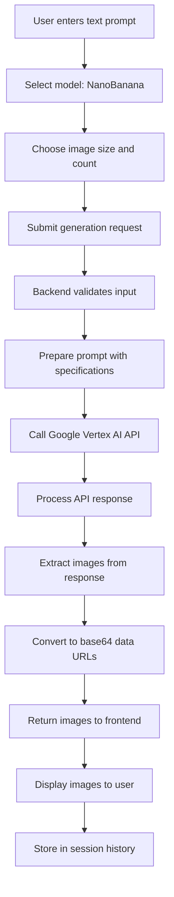
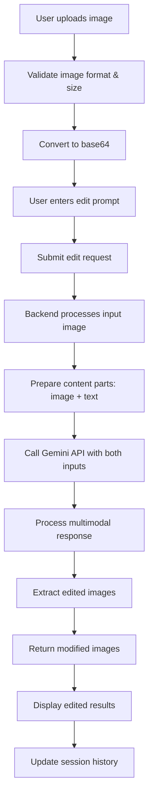

# NanoBanana Image Generation and Editing Workflow

## Overview

**NanoBanana** (Google Gemini 2.5 Flash Image) is an advanced AI image generation model that supports both text-to-image generation and image-to-image editing. This document provides a comprehensive guide to the complete workflow for generating and editing images using the NanoBanana model in the RTL-Deutschland RAG Chatbot API.

## Table of Contents

- [What is NanoBanana?](#what-is-nanobanana)
- [Key Features](#key-features)
- [Architecture Overview](#architecture-overview)
- [Complete Workflow](#complete-workflow)
- [API Usage](#api-usage)
- [Streamlit UI Workflow](#streamlit-ui-workflow)
- [Technical Implementation](#technical-implementation)
- [Configuration](#configuration)
- [Error Handling](#error-handling)
- [Best Practices](#best-practices)
- [Troubleshooting](#troubleshooting)

## What is NanoBanana?

NanoBanana is Google's **Gemini 2.5 Flash Image** model, a state-of-the-art image generation AI that offers:

- **Text-to-Image Generation**: Create images from descriptive text prompts
- **Image-to-Image Editing**: Modify existing images based on text instructions
- **Multi-Image Generation**: Generate up to 10 distinct images per request
- **High-Quality Output**: Professional-grade image generation with excellent prompt understanding
- **Fast Processing**: Optimized for speed while maintaining quality

## Key Features

### 🎨 **Dual Generation Modes**
- **Text-to-Image**: Generate completely new images from text descriptions
- **Image-to-Image**: Edit and modify existing images using text prompts

### 🚀 **Superior Capabilities**
- **Multi-Image Support**: Generate 1-10 images per request (more than DALL-E 3's 1 or Imagen's 4)
- **Large File Support**: Handle input images up to 10MB
- **Context Awareness**: Maintain conversation history for iterative editing
- **Session Management**: Track image generation history across user sessions

### 🛡️ **Robust Processing**
- **Safety Filters**: Built-in content safety and policy compliance
- **Error Handling**: Comprehensive error management with detailed feedback
- **Format Support**: PNG, JPG, JPEG, WEBP input formats
- **Base64 Integration**: Seamless image handling via base64 encoding

## Architecture Overview

```
┌─────────────────┐    ┌─────────────────┐    ┌─────────────────┐
│   User Input    │    │   Frontend      │    │   Backend API   │
│                 │    │   Interface     │    │                 │
│ • Text Prompt   │───▶│ • Streamlit UI  │───▶│ • Flask App     │
│ • Input Image   │    │ • Validation    │    │ • NanoBanana    │
│ • Parameters    │    │ • Preview       │    │   Handler       │
└─────────────────┘    └─────────────────┘    └─────────────────┘
                                                       │
                                                       ▼
┌─────────────────┐    ┌─────────────────┐    ┌─────────────────┐
│   Response      │    │   Image         │    │   Google        │
│                 │    │   Processing    │    │   Vertex AI     │
│ • Generated     │◀───│ • Base64        │◀───│                 │
│   Images        │    │   Conversion    │    │ • Gemini 2.5    │
│ • Metadata      │    │ • Validation    │    │   Flash Image   │
│ • Error Info    │    │ • Storage       │    │ • Authentication│
└─────────────────┘    └─────────────────┘    └─────────────────┘
```

## Complete Workflow

### 1. Text-to-Image Generation Workflow



### 2. Image-to-Image Editing Workflow



## API Usage

### Single Image Generation Endpoint

**Endpoint**: `POST /image/generate`

#### Text-to-Image Request
```json
{
  "prompt": "A cyberpunk cityscape at night with neon lights",
  "size": "1024x1024",
  "n": 3,
  "model_choice": "NanoBanana",
  "session_id": "user-session-123"
}
```

#### Image-to-Image Edit Request
```json
{
  "prompt": "Make the sky purple and add flying cars",
  "size": "1024x1024",
  "n": 1,
  "model_choice": "NanoBanana",
  "input_image_base64": "data:image/png;base64,iVBORw0KGgoAAAANSUhEUgA...",
  "session_id": "user-session-123"
}
```

#### Response Format
```json
{
  "success": true,
  "is_base64": true,
  "image_urls": [
    "data:image/png;base64,iVBORw0KGgoAAAANSUhEUgA...",
    "data:image/png;base64,iVBORw0KGgoAAAANSUhEUgB...",
    "data:image/png;base64,iVBORw0KGgoAAAANSUhEUgC..."
  ],
  "prompt": "Enhanced prompt with generation specifications",
  "model": "gemini-2.5-flash-image",
  "size": "1024x1024",
  "operation_type": "text_to_image",
  "reference_image_used": false,
  "session_id": "user-session-123"
}
```

### Request Parameters

| Parameter | Type | Required | Description |
|-----------|------|----------|-------------|
| `prompt` | string/array | ✅ | Text description or prompt history |
| `size` | string | ✅ | Image dimensions: "1024x1024", "1024x1792", "1792x1024" |
| `n` | integer | ❌ | Number of images (1-10, default: 1) |
| `model_choice` | string | ✅ | Must be "NanoBanana" |
| `input_image_base64` | string | ❌ | Base64 image for editing (max 10MB) |
| `session_id` | string | ❌ | Session identifier for tracking |
| `reference_image_file_id` | string | ❌ | Frontend file tracking ID |

### Response Fields

| Field | Type | Description |
|-------|------|-------------|
| `success` | boolean | Generation success status |
| `is_base64` | boolean | Always true for NanoBanana |
| `image_urls` | array | Base64 data URLs of generated images |
| `prompt` | string | Final processed prompt |
| `model` | string | Model identifier |
| `size` | string | Image dimensions |
| `operation_type` | string | "text_to_image" or "image_to_image" |
| `reference_image_used` | boolean | Whether input image was provided |
| `session_id` | string | Session identifier |

## Streamlit UI Workflow

### 1. Initial Setup
When you select NanoBanana from the model dropdown, the UI automatically detects that this model supports both image generation and editing capabilities.

### 2. Image Upload (Optional for Editing)
If you want to edit an existing image, you can upload one using the file uploader. The system supports PNG, JPG, JPEG, and WEBP formats with a maximum file size of 10MB. If the file exceeds this limit, you'll see an error message.

### 3. Prompt Input and Configuration
The interface dynamically changes based on whether you're generating new images or editing existing ones:

- **For new image generation**: You'll see "Enter a prompt describing the image"
- **For image editing**: You'll see "Enter a prompt to modify the image"

You can also configure:
- **Image size**: Choose from 1024x1024, 1024x1792, or 1792x1024 pixels
- **Number of images**: Select between 1-10 images (NanoBanana supports generating up to 10 images at once)

### 4. Generation Process
When you click "Generate Image", the system:

1. **Prepares your request** with the prompt, size, and number of images
2. **Includes conversation history** for context-aware generation
3. **Adds input image** if you're editing an existing image
4. **Calls the API** and displays a loading message
5. **Processes the response** and extracts the generated images

### 5. Result Display and History Management
Once generation is complete:

- **View generated images**: Each image is displayed with a caption showing the model used
- **Download images**: Click the download button for each image to save it as a PNG file
- **Session history**: The system automatically saves your generated images and prompts for the current session
- **Memory management**: Only the last 5 images are kept in session history to prevent memory issues

You can view your previous images in the "View previous generated images" section, which helps with iterative editing and maintaining context.
