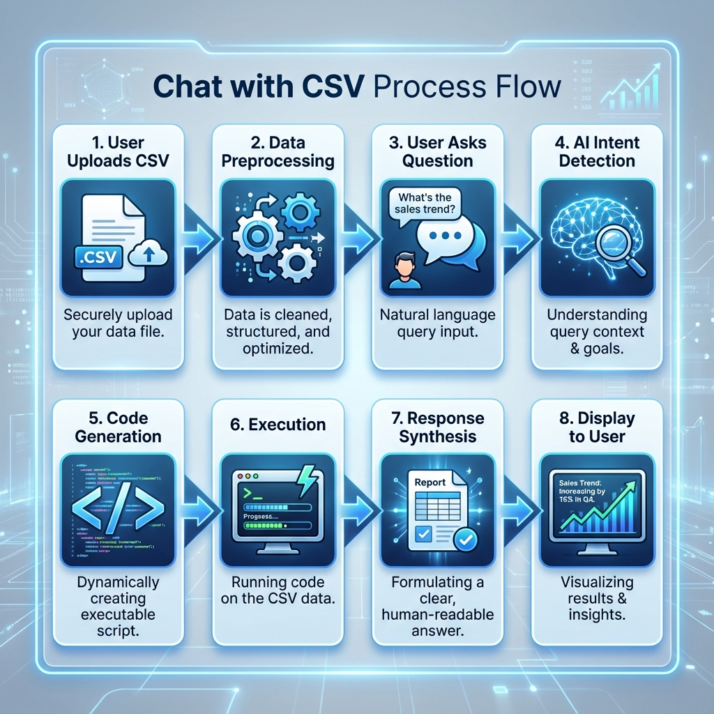
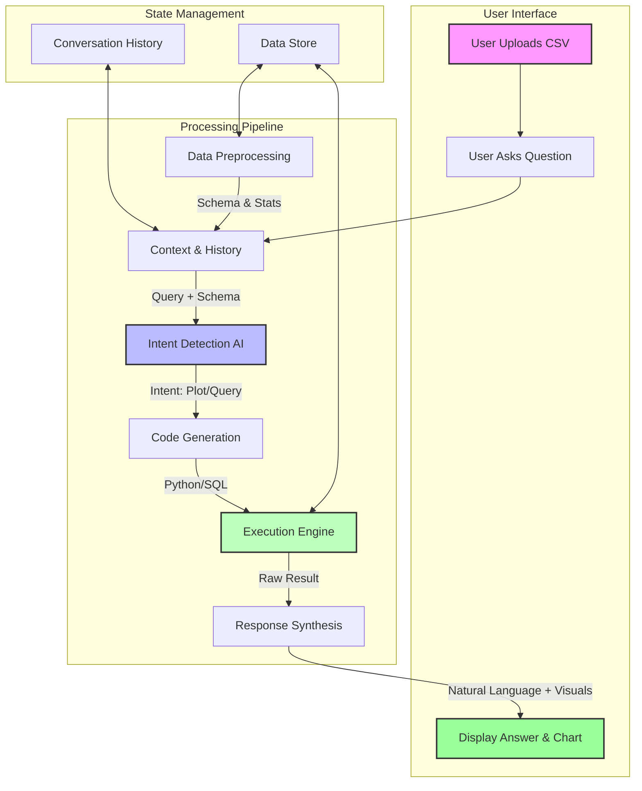
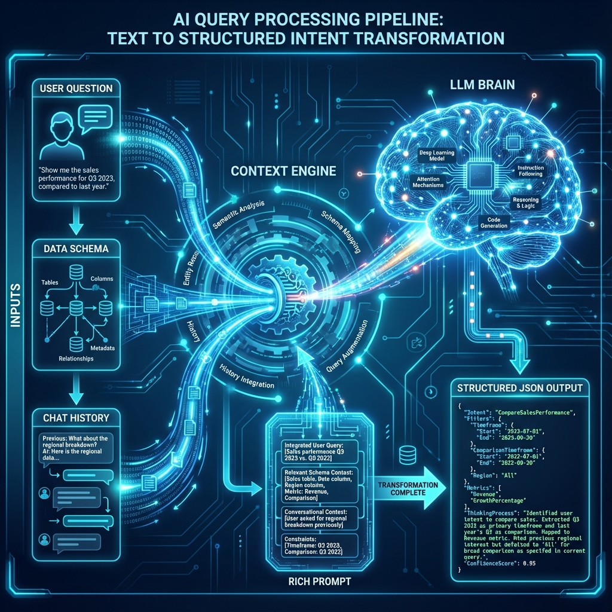
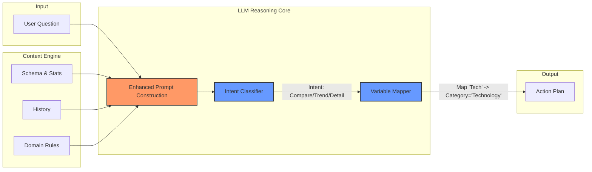

# Logical Architecture: Chat with CSV/Tabular Data

This document outlines the logical steps involved in a system that allows users to chat with their CSV or tabular data (single file or multiple files together). The process transforms raw data into actionable insights through a pipeline of parsing, semantic analysis, code generation, and visualization.

## The Logical Workflow

### 1. Data Ingestion & Preprocessing
*   **Input:** User uploads one or more CSV or Excel files.
*   **Action (per file):** The system parses each file to understand its structure.
    *   *Type Inference:* Detecting if a column is a date, a number, or a category.
    *   *Cleaning:* Handling missing values or malformed headers.
    *   *Tabular DB Creation:* Each file is materialized into its own SQLite database
        (`tabular_data.db`) with rich schema metadata.
    *   *Deduplication:* The original file is hashed; if a matching hash exists, reuse the cached
        `tabular_data.db` instead of reprocessing.
    *   *Storage:* Encrypted original file and metadata are kept in a per-file directory under
        `chroma_db/<file_id>/`.
*   **Multi-file Unification (when multiple files are selected for a chat):**
    *   A temporary **unified SQLite database** is created per chat request, keyed by a `session_id`.
    *   Individual `tabular_data.db` files are **ATTACH**ed and tables are **copied** into the unified
        database.
    *   Tables are **renamed** to avoid conflicts using `{filename}_{tablename}`.
    *   Two source-tracking columns are added to every unified table:
        `_source_file_id` and `_source_filename`.
*   **Output:** One or more clean **Data Schemas** with cached per-file SQLite DBs and an on-demand
    unified DB for multi-file queries.

### 2. User Interaction & Context
*   **Input:** User asks a question (e.g., "Show me the sales trend over the last year").
*   **Context:** The system retrieves **Conversation History** to understand if this is a follow-up question (e.g., "Now break it down by region").

### 3. Intent Detection & Semantic Analysis
*   **Action:** An AI model (LLM) analyzes the user's query alongside the active Data Schema:
    *   For **single-file** chat: the schema of that file’s database.
    *   For **multi-file** chat: the merged schema of the unified database (all tables from all selected files).
*   **Goal:** Determine the user's intent.
    *   *Retrieval:* "What is the total revenue?"
    *   *Visualization:* "Plot a bar chart of sales by region."
    *   *Transformation:* "Filter out cancelled orders."
*   **Output:** A structured **Intent** (e.g., `Action: Plot`, `Variables: [Date, Sales]`, `Type: LineChart`).

### 4. Code / Query Generation
*   **Action:** The system translates the Intent into executable code.
    *   *Python/Pandas:* For complex data manipulation and plotting.
    *   *SQL:* For querying large datasets.
    *   *Vega-Lite/Plotly:* For generating chart specifications.
*   **Safety:** The code is generated to be safe and read-only regarding the original data source.

### 5. Execution Engine
*   **Action:** The generated code is executed in a sandboxed environment.
*   **Output:**
    *   *Computation Result:* A specific number, a table of data, or a chart object.
    *   *Error Handling:* If execution fails, the system feeds the error back to the AI to attempt a self-correction.

### 6. Response Synthesis
*   **Action:** The system packages the result for the user.
    *   *Visuals:* Rendering the chart or table.
    *   *Narrative:* Using the AI to generate a natural language explanation of the result (e.g., "As you can see, sales peaked in Q4...").
*   **History:** The interaction is saved to the conversation history for future context.

### 7. Display
*   **Action:** The final response (Text + Chart/Table) is displayed to the user interface.

## Unified Query Database Strategy (Multi-File Chat)

When the user uploads **multiple CSV/Excel files** and chats with them together, the system uses a
**Unified Query Database** strategy (implemented via `TabularDataHandler`) instead of routing queries
to one file at a time.

- **Individual file storage**
    - **Per-file directory** under `chroma_db/<file_id>/` containing encrypted original file, metadata,
        and cached `tabular_data.db` (deduplicated by file hash).

- **Unified temporary database**
    - For each chat request involving multiple tabular files, a **temporary unified SQLite database** is
        created in `chroma_db/unified_<session_id>/`.
    - Each per-file `tabular_data.db` is **ATTACH**ed; tables are **copied** into the unified database.
    - Tables are **renamed** using `{filename}_{tablename}` to avoid collisions.
    - Two extra columns are added to every unified table:
        - `_source_file_id` – original file identifier.
        - `_source_filename` – original filename for attribution.

- **Single SQL agent over all tables**
    - A single LangChain SQL agent is initialized on top of the **unified database** and can:
        - See **all tables** from all selected files at once.
        - Run **JOINs** and **aggregations** across files.
        - Use source columns to explain **which file** each row came from.

- **Lifecycle & cleanup**
    - The unified database is created **on-demand per chat request**, with a `session_id` such as
        `{user_id}_{timestamp}_{hash_of_file_ids}`.
    - After responding, the unified directory is **deleted**; individual per-file databases remain cached.

This strategy eliminates routing errors, enables cross-file analytics, supports concurrent users via
isolated session databases, and remains memory-efficient.

### Note on prior routing-based approach
Multi-file query routing to separate databases is deprecated. A single agent over the unified database
avoids ambiguity and enables true cross-file JOINs and aggregations.

### Benefits
1. **Accurate results**: No misrouting when schemas are similar.
2. **Cross-file analysis**: JOIN and aggregate across sources.
3. **Efficiency**: Deduplication avoids reprocessing; unified DB is ephemeral.
4. **Concurrency**: Per-request session DBs isolate users.
5. **Transparency**: Source columns provide clear attribution.

## Visual Flowchart

---

# Deep Dive: Query Processing Pipeline

This section details the "Brain" of the system: how a raw user question is transformed into a precise executable command. This involves a multi-stage pipeline of context analysis, schema injection, and intent classification.

## The "Enhanced Prompt" Architecture

When a user asks a question, we don't just send it to the LLM. We construct a **Rich Context Prompt** that gives the AI the necessary "eyes" to see the data.

### 1. Intelligent Context Analysis
Before processing the question, the system gathers three key pieces of context:
*   **Data Schema Context:** Not just column names, but *types* and *sample values*.
    *   *Example:* `Column 'Revenue' (Float, range: 10k-1M)`, `Column 'Region' (Category: 'North', 'South', 'East', 'West')`.
*   **Conversation History:** What was asked before?
    *   *User:* "Show me sales." -> *System:* "Here is the sales chart."
    *   *User:* "Now filter by North." -> *System:* (Understands "Filter [Sales Chart] by [Region=North]").
*   **Domain Knowledge:** Optional injected rules (e.g., "Fiscal year starts in April").

### 2. Intent Classification with Database Awareness
The AI analyzes the user's natural language against the "Database Context" to classify the intent. It doesn't just guess; it maps words to schema.

*   **Input:** "How did our tech products perform in Q4?"
*   **Mapping Process:**
    *   "Tech products" -> Matches `Category` column value `'Technology'`.
    *   "Perform" -> Ambiguous. Checks schema for metrics. Maps to `Sales` or `Profit`.
    *   "Q4" -> Maps to `Date` column filter `Oct-Dec`.
*   **Classification Output:**
    *   **Intent Type:** `AGGREGATION_AND_FILTER`
    *   **Primary Metric:** `Sum(Sales)`
    *   **Dimensions:** `None`
    *   **Filters:** `Category='Technology'`, `Month in [10, 11, 12]`

## Visual Pipeline: From Question to Code

