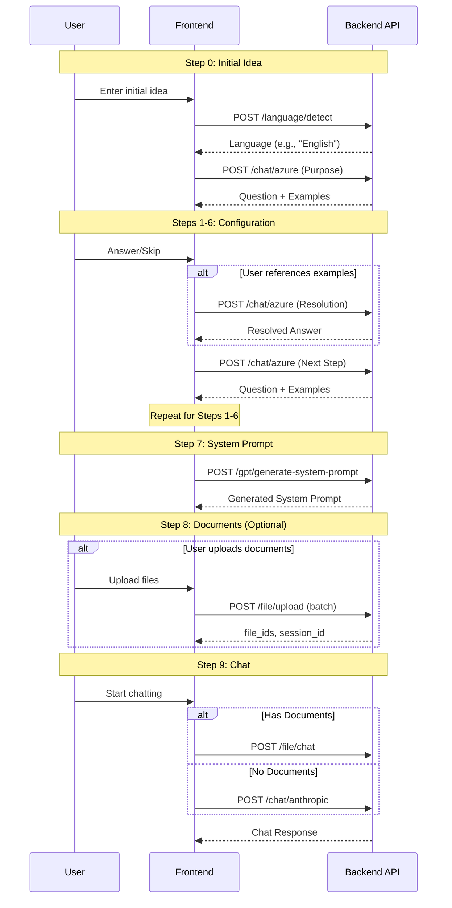
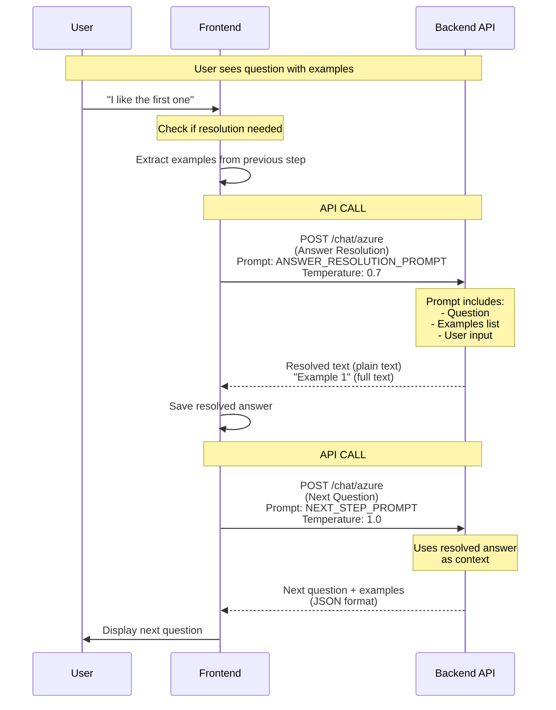

# Custom GPT API Integration Guide

This document provides a comprehensive guide for integrating Custom GPT functionality using the backend APIs. It details all API calls needed to replicate the Streamlit Custom GPT Creator in other frontends.

## Table of Contents

1. [Overview](#overview)
2. [Authentication](#authentication)
3. [Complete API Reference](#complete-api-reference)
4. [Step-by-Step API Flow](#step-by-step-api-flow)
5. [Workflow Diagrams](#workflow-diagrams)
6. [Session State Management](#session-state-management)
7. [Error Handling](#error-handling)
8. [Example Implementations](#example-implementations)
9. [Testing Guide](#testing-guide)

---

## Overview

The Custom GPT creation process consists of 9 steps:
1. **Steps 0-6**: Configuration through guided questions (each supports a **Skip** button)
2. **Step 7**: System prompt generation
3. **Step 8**: Optional document upload
4. **Step 9**: Chat initiation

### Base Configuration

- **Base URL**: Your API base URL (e.g., `http://localhost:8080` or `https://api.example.com`)
- **Content-Type**: `application/json` (for JSON endpoints)
- **Content-Type**: `multipart/form-data` (for file uploads)

---

## Authentication

### Authentication Requirements

Most endpoints require authentication via Bearer token in the Authorization header:

```http
Authorization: Bearer <your-auth-token>
```

**Note**: In local development environments, authentication may be bypassed. Check your backend configuration.

### Getting Authentication Token

Authentication tokens are typically obtained through:
- OAuth2 flow
- JWT token from login endpoint
- API key (if configured)

**Example Request with Authentication**:
```javascript
const headers = {
  'Authorization': `Bearer ${authToken}`,
  'Content-Type': 'application/json'
};
```

---

## Complete API Reference

### 1. Language Detection API

**Endpoint**: `POST /language/detect`

**Purpose**: Detect the language of user input to customize prompts

**Authentication**: Required (may be bypassed in local dev)

**Request**:
```json
{
  "text": "I want to create a customer service assistant"
}
```

**Response**:
```json
{
  "language": "English"
}
```

**Usage**: Called automatically when user enters initial idea to determine prompt language.

---

### 2. Azure Chat API (Question Generation & Answer Resolution)

**Endpoint**: `POST /chat/azure`

**Purpose**:
- Generate contextual follow-up questions for configuration steps
- Resolve user input references to examples

**Authentication**: Required

**Request Format**:
```json
{
  "model": "gpt_4_1",
  "message": "<formatted_prompt_with_placeholders>",
  "temperature": 1.0,
  "step_name": "purpose_clarification"  // Optional, for backend logging
}
```

**Response Format** (Question Generation):
```json
{
  "question": "What specific problem should your GPT solve?",
  "examples": [
    "Help customers troubleshoot login issues",
    "Generate email responses for common inquiries",
    "Provide product recommendations"
  ]
}
```

**Response Format** (Answer Resolution):
Plain text response with resolved answer.

**Common Use Cases**:
- Step 1: Purpose Clarification
- Step 2: Audience Understanding
- Step 4: Capabilities Definition
- Step 5: Knowledge & Context
- Step 6: Examples Collection
- Answer Resolution (before saving user input)

---

### 3. System Prompt Generation API

**Endpoint**: `POST /gpt/generate-system-prompt`

**Purpose**: Synthesize all collected inputs into a production-ready system prompt

**Authentication**: Required

**Request**:
```json
{
  "name": "Customer Service Assistant",
  "purpose": "Help customers troubleshoot common issues",
  "audience": "Support team members",
  "tone": "Professional & Concise",
  "capabilities": "Answer FAQs\nTroubleshoot issues\nEscalate complex problems",
  "constraints": "Don't make refund promises\nAvoid medical advice",
  "knowledge": "Product catalog, common issues, company policies",
  "example_interaction": "User: My order isn't showing. Bot: Let me help troubleshoot...",
  "custom_instructions": "Always be polite and professional",
  "language": "English"
}
```

**Response**:
```json
{
  "system_prompt": "You are a Customer Service Assistant...[full prompt text]"
}
```

**Benefits**:
- Backend validation
- Optimized parameters (temperature=1.0, max_tokens=2000)
- Automatic prompt extraction
- Language-aware generation

---

### 4. File Upload API

**Endpoint**: `POST /file/upload`

**Purpose**: Upload reference documents for Custom GPT

**Authentication**: Required

**Request Format**: `multipart/form-data`

**Single File Upload**:
```python
files = {"file": (filename, file_content, content_type)}
data = {
  "username": "user123",
  "is_image": "false",
  "custom_gpt": "true"  # Important: Set to "true" for Custom GPT uploads
}
```

**Batch File Upload** (Recommended):
```python
files = [
  ("files", (filename1, file_content1, content_type1)),
  ("files", (filename2, file_content2, content_type2))
]
data = {
  "username": "user123",
  "is_image": "false",
  "custom_gpt": "true"
}
```

**Response** (Single File):
```json
{
  "file_id": "file-abc123",
  "original_filename": "document.pdf",
  "session_id": "session-xyz789",
  "status": "success",
  "message": "File processed successfully"
}
```

**Response** (Batch Upload):
```json
{
  "multi_file_mode": true,
  "file_ids": ["file-abc123", "file-def456"],
  "original_filenames": ["doc1.pdf", "doc2.txt"],
  "statuses": ["success", "success"],
  "session_id": "session-xyz789",
  "message": "Files processed successfully"
}
```

**Important Notes**:
- Always set `custom_gpt: "true"` for Custom GPT document uploads
- Use batch upload for multiple files (more efficient)
- Store `session_id` for chat initialization
- Store all `file_ids` for document-based chat

---

### 5. Available Models API

**Endpoint**: `GET /available-models`

**Purpose**: Get list of available AI models for selection

**Authentication**: Required

**Request**: None (GET request)

**Response**:
```json
{
  "models": [
    "gpt_4o_mini",
    "gpt_4o",
    "gemini-2.5-flash",
    "gemini-2.5-pro",
    "claude-sonnet-4-5"
  ],
  "model_types": {
    "text": ["gpt_4o_mini", "gpt_4o", "gemini-2.5-flash", "gemini-2.5-pro", "claude-sonnet-4-5"],
    "image": ["dall-e-3", "imagen-3.0-generate-002"]
  }
}
```

**Usage**: Call this endpoint to populate model selection dropdown in settings.

---

### 6. File Chat API (With Documents)

**Endpoint**: `POST /file/chat`

**Purpose**: Chat with Custom GPT that has reference documents

**Authentication**: Required

**Request**:
```json
{
  "text": ["Hello, how can you help me?"],
  "model_choice": "gpt_4o_mini",
  "user_id": "user123",
  "generate_visualization": false,
  "session_id": "session-xyz789",
  "custom_gpt": true,
  "system_prompt": "You are a Customer Service Assistant...",
  "file_ids": ["file-abc123", "file-def456"],
  "temperature": 0.7
}
```

**Response**:
```json
{
  "response": "Hello! I'm here to help you with...",
  "session_id": "session-xyz789",
  "intermediate_steps": "Optional agent reasoning steps"
}
```

**When to Use**: When Custom GPT has uploaded documents (`file_ids` array is not empty).

---

### 7. Anthropic Chat API (Without Documents)

**Endpoint**: `POST /chat/anthropic`

**Purpose**: Chat with Custom GPT without reference documents

**Authentication**: Required

**Request**:
```json
{
  "text": ["Hello, how can you help me?"],
  "model_choice": "claude-sonnet-4-5",
  "user_id": "user123",
  "session_id": "generated-session-id",
  "custom_gpt": true,
  "system_prompt": "You are a Customer Service Assistant...",
  "temperature": 0.8
}
```

**Response**:
```json
{
  "response": "Hello! I'm here to help you with...",
  "session_id": "generated-session-id"
}
```

**When to Use**: When Custom GPT has no uploaded documents.

**Note**: For Anthropic models, use model names like `"claude-sonnet-4@20250514"` or `"claude-sonnet-4-5"`.

---

## Step-by-Step API Flow

### Step 0: Initial Idea & Language Detection

**User Action**: Enter initial idea (e.g., "I want a customer service assistant")

**API Calls**:
1. `POST /language/detect` - Detect language
2. `POST /chat/azure` - Generate purpose clarification question

**Flow**:
```javascript
// 1. Detect language
const langResponse = await fetch(`${API_URL}/language/detect`, {
  method: 'POST',
  headers: { 'Content-Type': 'application/json', 'Authorization': `Bearer ${token}` },
  body: JSON.stringify({ text: initialIdea })
});
const { language } = await langResponse.json();

// 2. Generate purpose question
const purposeResponse = await fetch(`${API_URL}/chat/azure`, {
  method: 'POST',
  headers: { 'Content-Type': 'application/json', 'Authorization': `Bearer ${token}` },
  body: JSON.stringify({
    model: 'gpt_4_1',
    message: PURPOSE_CLARIFICATION_PROMPT.replace('{USER_INITIAL_RESPONSE}', initialIdea).replace('{LANGUAGE}', language),
    temperature: 1,
    step_name: 'purpose_clarification'
  })
});
const purposeData = await purposeResponse.json();
```

---

### Steps 1-6: Guided Configuration

Each step follows this pattern:

1. **Display Question**: Show question and examples from previous API call
2. **User Input**: User provides answer (or skips)
3. **Answer Resolution** (OPTIONAL, separate API call): Resolve references to examples
4. **Next Question Generation** (separate API call): Generate next step's question

#### Important: Answer Resolution is a Separate API Call

**Answer Resolution is NOT part of question generation** - it is a **separate, additional API call** that happens between user input and the next question generation.

**Flow**:
```
User Input
    ↓
[OPTIONAL] POST /chat/azure (Answer Resolution) ← Separate API call
    ↓
Resolved Answer
    ↓
POST /chat/azure (Next Question Generation) ← Separate API call
    ↓
Next Question Displayed
```

#### Skip Functionality

Each step (1-6) supports a **Skip →** button:
- If skipped, empty string (`""`) is passed to next step
- Next question is still generated but without that context
- System prompt generator receives empty strings for skipped fields
- **No Answer Resolution call is made when skipping**

#### Smart Answer Resolution (Separate API Call)

> **⚠️ IMPORTANT**: Answer Resolution requires a **separate API call** to `POST /chat/azure`. It is **NOT** part of the question generation call. You must make **two separate API calls**:
> 1. **First call**: Answer Resolution (optional, only if needed)
> 2. **Second call**: Next Question Generation (always required)

**When to Call**: Before saving user input, if the user's input might reference examples (e.g., "I like the first one", "Combine examples 1 and 2")

**API**: `POST /chat/azure` (This is a **separate API call**, not part of question generation)

**Endpoint**: Same as question generation (`/chat/azure`), but with different prompt template

**Request**:
```json
{
  "model": "gpt_4_1",
  "message": "ANSWER_RESOLUTION_PROMPT with {QUESTION}, {EXAMPLES_LIST}, {USER_INPUT}",
  "temperature": 0.7,
  "step_name": "purpose_clarification_answer_resolution"
}
```

**Response**: Plain text with resolved answer (not JSON)

**Logic**:
1. Check if user input might reference examples (e.g., contains "first", "second", "combine", etc.)
2. **If yes**: Make **separate API call** to `/chat/azure` with `ANSWER_RESOLUTION_PROMPT`
3. **If no**: Skip resolution, use user input as-is
4. Use resolved answer (or original input) for next question generation
5. Make **another separate API call** to `/chat/azure` for next question generation

**Example Flow**:
```javascript
// Step 1: User sees question with examples
const questionData = await getPurposeQuestion(initialIdea);
// questionData = { question: "...", examples: ["Example 1", "Example 2"] }

// Step 2: User provides input
const userInput = "I like the first one";

// Step 3: OPTIONAL - Answer Resolution (SEPARATE API CALL)
const resolvedAnswer = await resolveAnswer(
  userInput,
  questionData.question,
  questionData.examples
);
// resolvedAnswer = "Example 1" (full text)

// Step 4: Next Question Generation (SEPARATE API CALL)
const nextQuestion = await getAudienceQuestion(initialIdea, resolvedAnswer);
// nextQuestion = { question: "...", examples: [...] }
```

**Key Points**:
- Answer Resolution is a **separate API call** to `POST /chat/azure`
- It uses `ANSWER_RESOLUTION_PROMPT` template (different from question generation)
- It happens **before** the next question generation call
- It's **optional** - only call if user input might reference examples
- Question generation is **always** a separate call after resolution (or directly after user input if no resolution needed)

---

### Step 7: System Prompt Generation

**API**: `POST /gpt/generate-system-prompt`

**When**: After Step 6 (Examples Collection) is completed

**Request**: Include all collected inputs (empty strings for skipped steps)

**Response**: Generated system prompt

**Error Handling**: Retry on failure, no fallback available

---

### Step 8: Document Upload (Optional)

**API**: `POST /file/upload`

**When**: User uploads documents in settings page

**Best Practice**: Use batch upload for multiple files

**Important**:
- Set `custom_gpt: "true"` in form data
- Store `session_id` from response
- Store all `file_ids` for chat

**Example** (JavaScript):
```javascript
const formData = new FormData();
uploadedFiles.forEach(file => {
  formData.append('files', file);
});
formData.append('username', username);
formData.append('is_image', 'false');
formData.append('custom_gpt', 'true');

const response = await fetch(`${API_URL}/file/upload`, {
  method: 'POST',
  headers: { 'Authorization': `Bearer ${token}` },
  body: formData
});
```

---

### Step 9: Start Chatting

**API Selection**:
- **With documents**: `POST /file/chat`
- **Without documents**: `POST /chat/anthropic`

**Required Parameters**:
- `custom_gpt: true`
- `system_prompt`: Generated system prompt
- `session_id`: From document upload (or generate new UUID)
- `file_ids`: Array of file IDs (only for `/file/chat`)

**Ongoing Chat**: Continue using same endpoint with same `session_id` to maintain context.

---

## Workflow Diagrams

### Complete Creation Flow



### Answer Resolution Flow (Two Separate API Calls)

This diagram shows that Answer Resolution and Next Question Generation are **two separate API calls**:



**Key Points**:
- **Two separate API calls** to the same endpoint (`/chat/azure`)
- **Different prompts**: `ANSWER_RESOLUTION_PROMPT` vs step-specific prompt (e.g., `AUDIENCE_UNDERSTANDING_PROMPT`)
- **Different temperatures**: 0.7 for resolution, 1.0 for question generation
- **Different response formats**: Plain text for resolution, JSON for question generation
- Resolution call is **optional** (only if user input references examples)
- Question generation call is **always** made after resolution (or directly after user input)

---

## Session State Management

### Required Session Variables

```javascript
{
  // Custom GPT Mode
  "custom_gpt_mode": true,

  // Generated Configuration
  "custom_gpt_system_prompt": "You are a...",
  "custom_gpt_name": "My Assistant",
  "custom_gpt_language": "English",

  // Documents (if uploaded)
  "custom_gpt_document_ids": ["file-abc123", "file-def456"],
  "custom_gpt_document_names": ["doc1.pdf", "doc2.txt"],
  "current_session_id": "session-xyz789",

  // Model Settings
  "model_choice": "gpt_4o_mini",
  "temperature": 0.7,

  // User Info
  "username": "user123",

  // Chat History
  "messages": [
    {"role": "user", "content": "Hello"},
    {"role": "assistant", "content": "Hi! How can I help?"}
  ],

  // Step Progress
  "current_step": 8,
  "last_initial_response": "...",
  "last_purpose_response": "...",
  "target_audience": "...",
  "last_tone_style": "...",
  "top_capabilities": "...",
  "avoid_doing": "...",
  "specialized_knowledge": "...",
  "ideal_interaction": "...",
  "custom_instructions": "..."
}
```

---

## Error Handling

### Common Error Scenarios

#### 1. Authentication Errors (403)

**Cause**: Missing or invalid authentication token

**Solution**:
```javascript
// Add authentication header
headers: {
  'Authorization': `Bearer ${authToken}`,
  'Content-Type': 'application/json'
}
```

#### 2. Azure API Failure (Steps 1-6)

**Status**: 500

**Handling**:
- Retry logic recommended
- Fallback: User can press **Skip →** to continue

#### 3. System Prompt Generation Failure (Step 7)

**Status**: 500

**Handling**:
- Retry logic recommended
- Show error message to user
- No fallback available

#### 4. Document Upload Failure (Step 8)

**Status**: 400/500

**Handling**:
- Per-file error handling
- Continue with successful uploads
- Show specific error for failed files

**Error Response Format**:
```json
{
  "code": "ERROR_CODE",
  "key": "error_key",
  "message": "Detailed error message",
  "detail": {
    "additional": "context"
  }
}
```

#### 5. Chat Initialization Failure (Step 9)

**Status**: 400 (missing session_id or parameters)

**Handling**:
- Verify all required parameters are present
- Check `session_id` is valid
- Ensure `custom_gpt: true` is set

---

## Example Implementations

### Next.js Example

This example shows a complete Next.js project bootstrapped with `create-next-app` implementing the Custom GPT API integration.

#### Project Setup

```bash
# Create Next.js project
npx create-next-app@latest custom-gpt-app --typescript --tailwind --app
cd custom-gpt-app

# Install additional dependencies
npm install axios
```

#### Environment Variables

Create `.env.local`:

```env
NEXT_PUBLIC_API_URL=http://localhost:8080
NEXT_PUBLIC_AUTH_TOKEN=your-auth-token
```

#### API Utility Functions

Create `lib/api.ts`:

```typescript
import axios from 'axios';

const API_URL = process.env.NEXT_PUBLIC_API_URL || 'http://localhost:8080';
const AUTH_TOKEN = process.env.NEXT_PUBLIC_AUTH_TOKEN || '';

// Helper: API request with auth
export async function apiRequest<T>(
  endpoint: string,
  method: 'GET' | 'POST' = 'GET',
  body?: unknown
): Promise<T> {
  const headers: Record<string, string> = {
    'Authorization': `Bearer ${AUTH_TOKEN}`,
    'Content-Type': 'application/json'
  };

  try {
    const response = await axios({
      method,
      url: `${API_URL}${endpoint}`,
      headers,
      data: body
    });
    return response.data;
  } catch (error) {
    if (axios.isAxiosError(error)) {
      throw new Error(
        `API error: ${error.response?.status} ${error.response?.statusText}`
      );
    }
    throw error;
  }
}

// Step 0: Language Detection & Purpose Question
export async function initializeCustomGPT(initialIdea: string) {
  // Detect language
  const { language } = await apiRequest<{ language: string }>(
    '/language/detect',
    'POST',
    { text: initialIdea }
  );

  // Generate purpose question
  const purposePrompt = PURPOSE_CLARIFICATION_PROMPT
    .replace('{USER_INITIAL_RESPONSE}', initialIdea)
    .replace('{LANGUAGE}', language);

  const purposeData = await apiRequest<{ question: string; examples: string[] }>(
    '/chat/azure',
    'POST',
    {
      model: 'gpt_4_1',
      message: purposePrompt,
      temperature: 1,
      step_name: 'purpose_clarification'
    }
  );

  return { language, purposeData };
}

// Answer Resolution - SEPARATE API CALL #1
// This is a separate API call that happens BEFORE next question generation
export async function resolveAnswer(
  userInput: string,
  question: string,
  examples: string[]
): Promise<string> {
  // If no examples, skip resolution and return input as-is
  if (!examples || examples.length === 0) {
    return userInput;
  }

  // Check if user input might reference examples
  const mightReferenceExamples = /first|second|third|combine|mix|merge|like|option|example/i.test(userInput);
  if (!mightReferenceExamples) {
    return userInput; // No resolution needed
  }

  // SEPARATE API CALL #1: Answer Resolution
  const examplesStr = examples.map(ex => `- ${ex}`).join('\n');
  const resolutionPrompt = ANSWER_RESOLUTION_PROMPT
    .replace('{QUESTION}', question)
    .replace('{EXAMPLES_LIST}', examplesStr)
    .replace('{USER_INPUT}', userInput);

  // This is a SEPARATE call to /chat/azure with ANSWER_RESOLUTION_PROMPT
  const response = await apiRequest<string>(
    '/chat/azure',
    'POST',
    {
      model: 'gpt_4_1',
      message: resolutionPrompt,
      temperature: 0.7, // Lower temperature for resolution
      step_name: 'answer_resolution'
    }
  );

  // Response is plain text (not JSON like question generation)
  return typeof response === 'string' ? response : String(response);
}

// Process Step with Answer Resolution
// This function shows the complete flow with TWO separate API calls
export async function processStep(
  userInput: string,
  currentStepData: { question: string; examples: string[] },
  nextStepPrompt: string
) {
  // STEP 1: Answer Resolution (OPTIONAL, SEPARATE API CALL)
  const resolvedAnswer = await resolveAnswer(
    userInput,
    currentStepData.question,
    currentStepData.examples
  );

  // STEP 2: Next Question Generation (ALWAYS, SEPARATE API CALL)
  // This is a DIFFERENT call to /chat/azure with the next step's prompt
  const nextQuestionData = await apiRequest<{ question: string; examples: string[] }>(
    '/chat/azure',
    'POST',
    {
      model: 'gpt_4_1',
      message: nextStepPrompt.replace('{RESOLVED_ANSWER}', resolvedAnswer),
      temperature: 1.0, // Higher temperature for question generation
      step_name: 'next_step_question'
    }
  );

  return nextQuestionData; // Returns { question, examples } in JSON format
}

// Step 7: Generate System Prompt
export async function generateSystemPrompt(config: {
  name: string;
  purpose: string;
  audience: string;
  tone: string;
  capabilities: string;
  constraints?: string;
  knowledge?: string;
  example_interaction?: string;
  custom_instructions?: string;
  language: string;
}) {
  return await apiRequest<{ system_prompt: string }>(
    '/gpt/generate-system-prompt',
    'POST',
    {
      name: config.name,
      purpose: config.purpose,
      audience: config.audience,
      tone: config.tone,
      capabilities: config.capabilities,
      constraints: config.constraints || null,
      knowledge: config.knowledge || null,
      example_interaction: config.example_interaction || null,
      custom_instructions: config.custom_instructions || null,
      language: config.language
    }
  );
}

// Step 8: Upload Documents
export async function uploadDocuments(files: File[], username: string) {
  const formData = new FormData();
  files.forEach(file => {
    formData.append('files', file);
  });
  formData.append('username', username);
  formData.append('is_image', 'false');
  formData.append('custom_gpt', 'true');

  const response = await axios.post(
    `${API_URL}/file/upload`,
    formData,
    {
      headers: {
        'Authorization': `Bearer ${AUTH_TOKEN}`
        // Don't set Content-Type for FormData - axios sets it automatically
      }
    }
  );

  return response.data;
}

// Step 9: Chat
export async function sendChatMessage(
  message: string,
  config: {
    fileIds?: string[];
    modelChoice: string;
    username: string;
    sessionId: string;
    systemPrompt: string;
    temperature?: number;
  }
) {
  const endpoint = config.fileIds?.length > 0
    ? '/file/chat'
    : '/chat/anthropic';

  const payload: Record<string, unknown> = {
    text: [message],
    model_choice: config.modelChoice,
    user_id: config.username,
    generate_visualization: false,
    session_id: config.sessionId,
    custom_gpt: true,
    system_prompt: config.systemPrompt
  };

  if (config.fileIds?.length > 0) {
    payload.file_ids = config.fileIds;
  }

  if (config.temperature !== undefined) {
    payload.temperature = config.temperature;
  }

  return await apiRequest<{ response: string; session_id: string }>(
    endpoint,
    'POST',
    payload
  );
}
```

#### React Component Example

Create `components/CustomGPTCreator.tsx`:

```typescript
'use client';

import { useState } from 'react';
import { initializeCustomGPT, processStep, generateSystemPrompt } from '@/lib/api';

export default function CustomGPTCreator() {
  const [currentStep, setCurrentStep] = useState(0);
  const [initialIdea, setInitialIdea] = useState('');
  const [language, setLanguage] = useState('English');
  const [stepData, setStepData] = useState<{ question: string; examples: string[] } | null>(null);
  const [userAnswers, setUserAnswers] = useState<Record<number, string>>({});

  const handleInitialIdea = async () => {
    if (!initialIdea.trim()) return;

    const { language: detectedLang, purposeData } = await initializeCustomGPT(initialIdea);
    setLanguage(detectedLang);
    setStepData(purposeData);
    setCurrentStep(1);
  };

  const handleStepAnswer = async (answer: string, nextStepPrompt: string) => {
    if (!stepData) return;

    // Process step with answer resolution and next question generation
    const nextQuestionData = await processStep(answer, stepData, nextStepPrompt);

    setUserAnswers(prev => ({ ...prev, [currentStep]: answer }));
    setStepData(nextQuestionData);
    setCurrentStep(prev => prev + 1);
  };

  return (
    <div className="container mx-auto p-6">
      <h1 className="text-3xl font-bold mb-6">Create Custom GPT</h1>

      {currentStep === 0 && (
        <div>
          <label className="block mb-2">What would you like to create a GPT for?</label>
          <textarea
            value={initialIdea}
            onChange={(e) => setInitialIdea(e.target.value)}
            className="w-full p-2 border rounded"
            rows={4}
          />
          <button
            onClick={handleInitialIdea}
            className="mt-4 px-4 py-2 bg-blue-500 text-white rounded"
          >
            Next →
          </button>
        </div>
      )}

      {currentStep > 0 && stepData && (
        <div>
          <h2 className="text-2xl font-semibold mb-4">{stepData.question}</h2>
          <div className="mb-4">
            <p className="font-medium mb-2">Examples:</p>
            <ul className="list-disc list-inside">
              {stepData.examples.map((ex, idx) => (
                <li key={idx}>{ex}</li>
              ))}
            </ul>
          </div>
          <textarea
            value={userAnswers[currentStep] || ''}
            onChange={(e) => setUserAnswers(prev => ({ ...prev, [currentStep]: e.target.value }))}
            className="w-full p-2 border rounded mb-4"
            rows={4}
            placeholder="Enter your answer or reference examples (e.g., 'I like the first one')"
          />
          <div className="flex gap-4">
            <button
              onClick={() => handleStepAnswer(userAnswers[currentStep] || '', NEXT_STEP_PROMPT)}
              className="px-4 py-2 bg-blue-500 text-white rounded"
            >
              Next →
            </button>
            <button
              onClick={() => handleStepAnswer('', NEXT_STEP_PROMPT)}
              className="px-4 py-2 bg-gray-500 text-white rounded"
            >
              Skip →
            </button>
          </div>
        </div>
      )}
    </div>
  );
}
```

#### API Route Example (Optional - for Server-Side)

Create `app/api/custom-gpt/route.ts`:

```typescript
import { NextRequest, NextResponse } from 'next/server';
import { apiRequest } from '@/lib/api';

export async function POST(request: NextRequest) {
  try {
    const body = await request.json();
    const { action, ...params } = body;

    let result;

    switch (action) {
      case 'initialize':
        result = await initializeCustomGPT(params.initialIdea);
        break;
      case 'processStep':
        result = await processStep(
          params.userInput,
          params.currentStepData,
          params.nextStepPrompt
        );
        break;
      case 'generateSystemPrompt':
        result = await generateSystemPrompt(params.config);
        break;
      default:
        return NextResponse.json(
          { error: 'Invalid action' },
          { status: 400 }
        );
    }

    return NextResponse.json(result);
  } catch (error) {
    return NextResponse.json(
      { error: error instanceof Error ? error.message : 'Unknown error' },
      { status: 500 }
    );
  }
}
```

#### Usage in Page

Update `app/page.tsx`:

```typescript
import CustomGPTCreator from '@/components/CustomGPTCreator';

export default function Home() {
  return (
    <main className="min-h-screen p-8">
      <CustomGPTCreator />
    </main>
  );
}
```

### Python Example

```python
import requests
from typing import List, Dict, Optional

API_URL = "http://localhost:8080"
AUTH_TOKEN = "your-auth-token"

def api_request(endpoint: str, method: str = "GET", json_data: Optional[Dict] = None):
    """Make authenticated API request"""
    headers = {
        "Authorization": f"Bearer {AUTH_TOKEN}",
        "Content-Type": "application/json"
    }

    response = requests.request(
        method=method,
        url=f"{API_URL}{endpoint}",
        headers=headers,
        json=json_data
    )
    response.raise_for_status()
    return response.json()

def upload_documents(files: List, username: str) -> Dict:
    """Upload documents for Custom GPT"""
    files_data = []
    for file_obj in files:
        file_obj.seek(0)  # Reset file pointer
        files_data.append(
            ("files", (file_obj.name, file_obj.getvalue(), file_obj.type))
        )

    form_data = {
        "username": username,
        "is_image": "false",
        "custom_gpt": "true"
    }

    headers = {"Authorization": f"Bearer {AUTH_TOKEN}"}

    response = requests.post(
        f"{API_URL}/file/upload",
        files=files_data,
        data=form_data,
        headers=headers
    )
    response.raise_for_status()
    return response.json()

# Usage examples
if __name__ == "__main__":
    # Generate system prompt
    system_prompt = api_request(
        "/gpt/generate-system-prompt",
        method="POST",
        json_data={
            "name": "Test Assistant",
            "purpose": "Help users",
            "audience": "Developers",
            "tone": "Professional & Concise",
            "capabilities": "Answer questions",
            "constraints": None,
            "knowledge": None,
            "example_interaction": None,
            "custom_instructions": None,
            "language": "English"
        }
    )

    # Chat with documents
    chat_response = api_request(
        "/file/chat",
        method="POST",
        json_data={
            "text": ["Hello"],
            "model_choice": "gpt_4o_mini",
            "user_id": "user123",
            "generate_visualization": False,
            "session_id": "session-xyz",
            "custom_gpt": True,
            "system_prompt": system_prompt["system_prompt"],
            "file_ids": ["file-abc123"],
            "temperature": 0.7
        }
    )
```

---

## Testing Guide

### Manual Testing Steps

1. **Complete Configuration Flow**
   - Enter initial idea
   - Complete all 6 steps (test both answers and skips)
   - Verify system prompt generation

2. **Test Answer Resolution**
   - Reference examples (e.g., "The first one")
   - Verify resolved text is saved correctly

3. **Test Document Upload**
   - Upload single file
   - Upload multiple files (batch)
   - Verify `file_ids` and `session_id` are returned

4. **Test Chat**
   - With documents (should use `/file/chat`)
   - Without documents (should use `/chat/anthropic`)
   - Verify custom GPT behavior in responses

5. **Test Error Handling**
   - Invalid authentication (403)
   - Missing parameters (400)
   - Server errors (500)

### Sample Test Data

```json
{
  "name": "Test Assistant",
  "purpose": "Help users test the system",
  "audience": "Developers and QA engineers",
  "tone": "Technical & Detailed",
  "capabilities": "Answer technical questions\nProvide code examples",
  "constraints": "No production deployments",
  "knowledge": "Testing frameworks and methodologies",
  "example_interaction": "User: How do I test this? Bot: Here's how...",
  "custom_instructions": "Always provide code examples",
  "language": "English"
}
```

---

## Implementation Checklist

### Frontend Requirements

- [ ] Implement authentication flow
- [ ] Implement 6-step configuration flow
- [ ] Store user responses from each step
- [ ] Provide Skip button for each step (1–6)
- [ ] Implement answer resolution logic
- [ ] Call `/chat/azure` for each configuration step
- [ ] Parse and display JSON responses (question + examples)
- [ ] Call `/gpt/generate-system-prompt` with all inputs
- [ ] Display generated system prompt
- [ ] Implement optional document upload UI
- [ ] Handle batch document upload
- [ ] Store `file_ids` and `session_id` from uploads
- [ ] Implement chat interface
- [ ] Route to correct endpoint based on document presence
- [ ] Include `custom_gpt: true` and `system_prompt` in chat requests
- [ ] Manage session state throughout the flow
- [ ] Handle errors gracefully with user-friendly messages

### Backend Requirements

- [ ] `/language/detect` endpoint configured
- [ ] `/chat/azure` endpoint configured with authentication
- [ ] `/gpt/generate-system-prompt` endpoint available
- [ ] `/file/upload` endpoint supporting `custom_gpt` parameter
- [ ] `/file/chat` endpoint supporting custom GPT mode
- [ ] `/chat/anthropic` endpoint supporting custom GPT mode
- [ ] `/available-models` endpoint for model selection
- [ ] Session management for document-based chats
- [ ] Support for `custom_gpt` and `system_prompt` parameters
- [ ] Proper error responses with structured format

---

## Prompt Templates

All prompt templates are defined in [`streamlit_components/custom_gpt_prompts.py`](../streamlit_components/custom_gpt_prompts.py):

- `PURPOSE_CLARIFICATION_PROMPT`
- `AUDIENCE_UNDERSTANDING_PROMPT`
- `CAPABILITIES_PROMPT`
- `KNOWLEDGE_CONTEXT_PROMPT`
- `EXAMPLES_PROMPT`
- `ANSWER_RESOLUTION_PROMPT`
- `CONVERSATION_STARTERS_PROMPT`

Copy these templates to your frontend or backend for consistent question generation.

---

## Additional Resources

- [Custom GPT README](./CUSTOM_GPT_README.md) - User-facing documentation
- [Streamlit Implementation](../streamlit_components/custom_gpt_creator.py) - Reference implementation
- [Main App Integration](../streamlit_app.py) - Chat integration example

---

## Support

For questions or issues:
1. Check existing documentation in `/docs`
2. Review implementation in `streamlit_components/custom_gpt_creator.py`
3. Check backend API logs for detailed error messages
4. Contact the development team

---

**Last Updated**: 2025-01-14  
**Version**: 2.0
