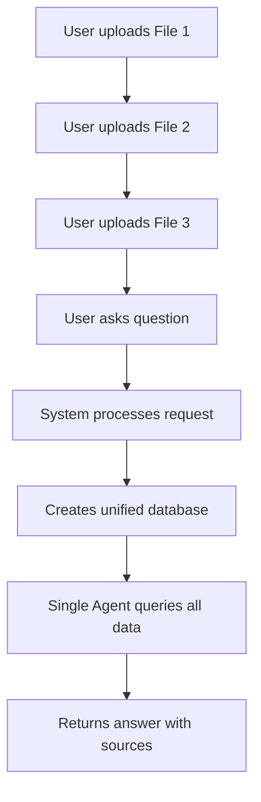

# Multi-File Tabular Data Chat Implementation

## Overview

This document explains how to enable users to upload and chat with multiple CSV/Excel files simultaneously using existing endpoints. The approach uses a unified database strategy with LangChain SQL agents to avoid routing errors and enable cross-file analysis.

## High-Level Flow



## Core Strategy

### Individual File Storage (Same as PDF)
Each uploaded file is stored separately:
- **Unique directory** per file with file_id
- **Encrypted original** file for security
- **Individual SQLite database** (tabular_data.db) for that file
- **Metadata** tracking file information
- **Hash-based deduplication** - if same file uploaded again, reuse existing database

### Unified Query Database (New for Multi-File)
When user asks a question:
- **Temporary unified database** created for this session
- **Merges all individual databases** into one
- **Single LangChain agent** queries the unified database
- **All tables accessible** together
- **Source tracking** via special columns
- **Cleaned up** after session ends

### Why This Approach?

**Problem with Smart Routing:**
- If two files have similar schemas, routing might pick wrong database
- User gets incorrect answer from wrong file
- Hard to do cross-file comparisons

**Solution with Unified Database:**
- All data visible to one agent
- No routing ambiguity
- Can JOIN across files
- Can aggregate across all sources
- Source attribution built-in

## Directory Structure

```
chroma_db/
├── file_id_1/                    # First uploaded file
│   ├── sales.csv.enc            # Encrypted original
│   ├── metadata.json            # File info
│   └── tabular_data.db          # Individual SQLite DB (cached)
│
├── file_id_2/                    # Second uploaded file
│   ├── inventory.xlsx.enc
│   ├── metadata.json
│   └── tabular_data.db          # Individual SQLite DB (cached)
│
├── file_id_3/                    # Third uploaded file
│   ├── orders.csv.enc
│   ├── metadata.json
│   └── tabular_data.db
│
└── unified_session_abc123/       # Temporary query database
    ├── unified_tabular.db       # Merged database
    ├── source_mapping.json      # Table → file_id mapping
    └── session_metadata.json    # Session info
```

## Implementation Flow Using Existing Endpoints

### Phase 1: File Upload (Existing Upload Endpoint)

When user uploads multiple CSV/Excel files through the existing upload endpoint:

1. **For each file uploaded:**
   - Calculate file hash
   - Check if file already exists (deduplication)
   - If exists: Download cached `tabular_data.db` from GCS
   - If new:
     - Generate unique file_id
     - Encrypt and store original file
     - Create individual `tabular_data.db` using existing `PrepareSQLFromTabularData`
     - Upload to GCS for caching
     - Store file hash mapping

2. **Return list of file_ids** to frontend
   - Frontend stores these file_ids for subsequent chat requests

### Phase 2: Chat Query (Existing Chat Endpoint)

When user asks a question through the existing chat endpoint:

1. **Receive request with:**
   - List of file_ids (instead of single file_id)
   - User question
   - Model choice

2. **Create unified database:**
   - Generate unique session_id for this request
   - Create temporary directory: `./chroma_db/unified_{session_id}/`
   - For each file_id:
     - Get individual `tabular_data.db`
     - Use SQLite ATTACH to connect to it
     - Copy tables to unified database
     - Add `_source_file_id` and `_source_filename` columns
     - Rename tables to avoid conflicts: `{filename}_{tablename}`
   - Save source mapping for reference

3. **Initialize TabularDataHandler:**
   - Modify existing TabularDataHandler to accept `file_ids` (list) instead of `file_id` (string)
   - Point to unified database instead of individual database
   - Create single LangChain SQL agent with access to all tables

4. **Process query:**
   - Agent sees all tables in unified database
   - Can query any table or JOIN across tables
   - Returns answer with source attribution

5. **Cleanup:**
   - Dispose database connections
   - Delete unified database directory
   - Original individual databases remain for caching

### Phase 3: TabularDataHandler Modifications

Modify existing `TabularDataHandler.__init__` to support multi-file mode:

**Detect multi-file mode:**
- If `file_ids` parameter is a list with multiple items
- Create unified database
- Use unified database path

**Build agent prompt:**
- Include information about all available tables
- Mention source tracking columns
- Explain table naming convention

**Single agent handles all queries:**
- No routing needed
- All data visible to agent
- Agent decides which tables to query

## How Unified Database Works

### Table Merging Process

1. **Create temporary unified database** in session directory
2. **For each individual database:**
   - Use SQLite ATTACH command to connect to it
   - Inspect available tables
   - Copy each table to unified database with renamed table name
   - Add source tracking columns: `_source_file_id`, `_source_filename`
   - Detach the database
3. **Result:** All tables from all files in one database with unique names

### Table Naming Convention

To avoid conflicts when merging tables:
- Original: `sales.csv` contains table `data`
- In unified DB: Table becomes `sales_data`
- Original: `inventory.xlsx` contains table `sheet1`
- In unified DB: Table becomes `inventory_sheet1`

This ensures no name collisions.

### Source Tracking

Every row in every table has two extra columns:
- `_source_file_id`: The file_id where this data came from
- `_source_filename`: The original filename for user-friendly attribution

Agent can use these for source attribution in answers.

### Agent Prompt Enhancement

When initializing the agent, provide comprehensive context:
- List all available tables with their source files
- Explain table naming pattern
- Mention source tracking columns
- Enable cross-file JOIN capability

## Comparison: PDF vs CSV Multi-File

| Aspect | PDF Approach | CSV/Excel Approach |
|--------|--------------|-------------------|
| **File Storage** | Encrypted PDFs in separate folders | Same - encrypted CSVs in separate folders |
| **Deduplication** | Hash check → download embeddings | Hash check → download tabular.db |
| **Individual Artifact** | ChromaDB collection per file | tabular_data.db per file |
| **Combined Artifact** | Query across all collections | Unified SQLite database |
| **Query Method** | Vector similarity search | SQL queries via agent |
| **Cross-file Capability** | Semantic search across all | SQL JOINs across tables |
| **Source Attribution** | Metadata in search results | Columns in data rows |

## Key Benefits

1. **Eliminates Routing Errors**
   - No need to guess which database to query
   - Single agent sees all data
   - User always gets correct answer

2. **Enables Cross-File Analysis**
   - JOIN sales data with inventory data
   - Aggregate across all uploaded files
   - Compare data from different sources

3. **Maintains Deduplication**
   - Same file uploaded twice uses cached database
   - No reprocessing of duplicate files
   - Storage and compute efficiency

4. **Concurrent User Support**
   - Each chat request gets unique session_id
   - Isolated unified databases per session
   - No interference between users

5. **Memory Efficient**
   - Unified database created on-demand
   - Cleaned up after request completes
   - Individual databases cached for reuse

6. **Built-in Source Tracking**
   - Every answer includes source attribution
   - User knows which file data came from
   - Transparent multi-file querying

## Session Management Strategy

**Session ID Generation:**
- Unique per chat request
- Format: `{user_id}_{timestamp}_{hash_of_file_ids}`
- Ensures isolation between requests

**Example Scenario:**
- User A queries: sales.csv + orders.csv
  - Creates: `unified_session_alice_123/`
- User B queries: inventory.csv + shipping.csv
  - Creates: `unified_session_bob_456/`
- Both can run simultaneously without conflict

## Cleanup Strategy

### Session Cleanup (Automatic)

After each chat request completes:
1. Dispose database connections
2. Delete unified database directory
3. Keep individual file directories (for caching)

**When:** Immediately after returning response to user

**What's deleted:** `./chroma_db/unified_{session_id}/` directory

**What's kept:** Individual file directories with cached databases

### File Cleanup (Scheduled)

Based on retention policy (e.g., 30 days):
1. Check upload timestamp in metadata
2. Delete old file directories
3. Remove from GCS
4. Clean up hash mappings

**When:** Background scheduled job

**What's deleted:** Individual file directories older than retention period

## Current Implementation Analysis

### Existing Multi-File Code (Lines 135-152)

The current [`csv_handler.py`](rtl_rag_chatbot_api/chatbot/csv_handler.py:135) has a **routing-based multi-file implementation**:

**What it does:**
- Initializes separate database and agent per file
- Uses [`_get_multi_file_answer()`](rtl_rag_chatbot_api/chatbot/csv_handler.py:957) to route questions
- Tries to guess which database to query based on:
  - Table names mentioned in question
  - LLM-based routing suggestion
  - Default to first file

**Problems with this approach:**
1. **Routing errors**: If files have similar schemas, might query wrong database
2. **No cross-file queries**: Cannot JOIN or aggregate across files
3. **Ambiguity**: User gets answer from one file, might be incomplete
4. **Complexity**: Routing logic adds overhead and potential failure points

### Recommended Refactoring

**Replace routing approach with unified database:**

1. **Remove routing logic** (lines 957-1044):
   - Delete [`_get_multi_file_answer()`](rtl_rag_chatbot_api/chatbot/csv_handler.py:957)
   - Delete [`_generate_all_tables_summary()`](rtl_rag_chatbot_api/chatbot/csv_handler.py:1046)
   - Delete [`_suggest_database_for_question()`](rtl_rag_chatbot_api/chatbot/csv_handler.py:1068)
   - Delete [`_enhance_question_with_context()`](rtl_rag_chatbot_api/chatbot/csv_handler.py:1125)

2. **Modify initialization** (lines 135-152):
   - When `is_multi_file` and `len(file_ids) > 1`:
     - Create unified database instead of separate databases
     - Initialize single agent for unified database
   - When single file:
     - Keep current behavior

3. **Simplify [`get_answer()`](rtl_rag_chatbot_api/chatbot/csv_handler.py:917)**:
   - Remove routing check (line 940-941)
   - Always use single agent approach
   - Unified database handles all queries

### Migration Strategy

**Phase 1: Add unified database creation**
- Add helper function to create unified database from individual databases
- Add session_id parameter to `__init__`
- Create unified database when `len(file_ids) > 1`

**Phase 2: Remove routing code**
- Delete routing methods
- Simplify `get_answer()` to always use single agent
- Update agent initialization to use unified database

**Phase 3: Cleanup**
- Remove unused attributes (separate engines, sessions, dbs per file)
- Keep only unified database components
- Add cleanup method for session databases

## Backward Compatibility

**Single File Mode (Unchanged):**
- When `file_ids` contains only one item
- Works exactly like current implementation
- No unified database needed

**Multi-File Mode (Refactored):**
- When `file_ids` contains multiple items
- Creates unified database (new approach)
- Single agent queries all data (replaces routing)
- Enables cross-file analysis

This refactoring eliminates routing errors while maintaining backward compatibility for single-file usage.

## Example User Flow

**Upload:**
1. User uploads `sales_q1.csv`, `sales_q2.csv`, `sales_q3.csv`
2. System returns: `["file_id_1", "file_id_2", "file_id_3"]`
3. Frontend stores these file_ids

**Query:**
1. User asks: "What's the total sales across all quarters?"
2. Frontend sends: `file_ids=["file_id_1", "file_id_2", "file_id_3"]`, `question="..."`
3. System creates unified database with all data
4. Agent queries: `SELECT SUM(sales) FROM sales_q1_data UNION ALL...`
5. Returns answer: "Total sales: $X (from sales_q1.csv, sales_q2.csv, sales_q3.csv)"

**Cross-File Analysis:**
1. User asks: "Compare Q1 vs Q3 sales"
2. Agent generates: `SELECT q1.region, q1.sales, q3.sales FROM sales_q1_data q1 JOIN sales_q3_data q3 ON q1.region = q3.region`
3. Returns comparison with source attribution

This is impossible with routing-based approaches.
