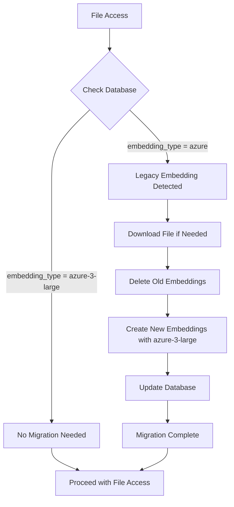

# Auto-Migration System Guide

## Overview

The Auto-Migration System provides **transparent, automatic migration** from legacy `azure` embeddings to the new `azure-3-large` embeddings. This system works seamlessly across all file access points without requiring manual intervention.

## Key Features

### ✨ **Simple & Transparent**
- **Single Rule**: If `embedding_type == "azure"` → Auto-migrate to `"azure-3-large"`
- **Database-First**: Always trusts database as single source of truth
- **Zero Configuration**: Works out of the box

### 🔄 **Automatic Migration Points**
1. **File Upload** - Checks and migrates during upload
2. **Chat Access** - Migrates before responding to queries  
3. **Status Check** - Triggers migration when checking embedding status

### 🚀 **High Performance**
- **Concurrent Processing**: Multiple files processed in parallel
- **Semaphore Control**: Prevents resource exhaustion
- **Reuses Infrastructure**: Leverages existing handlers and services

## Architecture

### Core Component: `AutoMigrationService`

Located at: `rtl_rag_chatbot_api/chatbot/auto_migration_service.py`

```python
from rtl_rag_chatbot_api.chatbot.auto_migration_service import AutoMigrationService

# Initialize service
service = AutoMigrationService(configs, gcs_handler, SessionLocal)

# Check and migrate a single file
result = await service.check_and_migrate_if_needed(
    file_id="abc123",
    embedding_handler=embedding_handler
)

# Check and migrate multiple files
results = await service.check_and_migrate_multiple_files(
    file_ids=["abc123", "def456"],
    max_concurrent=3
)
```

### Migration Flow



## Usage Examples

### 1. During File Upload

```python
# Automatic migration in upload endpoint
@app.post("/file/upload")
async def upload_file(...):
    # Check existing files for migration
    if parsed_existing_file_ids:
        auto_migration_service = AutoMigrationService(configs, gcs_handler, SessionLocal)

        migration_results = await auto_migration_service.check_and_migrate_multiple_files(
            file_ids=parsed_existing_file_ids,
            embedding_handler=embedding_handler,
            max_concurrent=3
        )

        # Log results
        migrated = [r for r in migration_results if r.get("migrated")]
        logging.info(f"Auto-migrated {len(migrated)} files")
```

### 2. During Chat

```python
# Automatic migration in chat endpoint
@app.post("/file/chat")
async def chat(query: Query, ...):
    # Collect all file IDs being accessed
    chat_file_ids = []
    if query.file_id:
        chat_file_ids.append(query.file_id)
    if query.file_ids:
        chat_file_ids.extend(query.file_ids)

    # Auto-migrate if needed
    if chat_file_ids:
        auto_migration_service = AutoMigrationService(configs, gcs_handler, SessionLocal)

        migration_results = await auto_migration_service.check_and_migrate_multiple_files(
            file_ids=chat_file_ids,
            max_concurrent=2
        )
```

### 3. During Status Check

```python
# Automatic migration in status endpoint
@app.get("/embeddings/status/{file_id}")
async def get_embedding_status(file_id: str, ...):
    auto_migration_service = AutoMigrationService(configs, gcs_handler, SessionLocal)

    # Check and migrate if needed
    migration_result = await service.check_and_migrate_if_needed(
        file_id=file_id,
        embedding_handler=embedding_handler
    )

    if migration_result.get("migrated"):
        logging.info(f"Auto-migrated {file_id} during status check")
```

## Migration Scenarios

### Scenario 1: Single File Upload (Old Embedding)

**Before**: User uploads a file that exists with `azure` embedding
**Process**:
1. System detects old embedding type from database
2. Auto-migrates to `azure-3-large`
3. User can immediately chat with new embeddings

**Result**: ✅ Transparent migration, no user intervention needed

### Scenario 2: Multi-File Upload (Mixed Embeddings)

**Before**: User uploads 3 files:
- File A: `azure` (old)
- File B: `azure-3-large` (current)  
- File C: New file

**Process**:
1. File A: Auto-migrated to `azure-3-large`
2. File B: No migration needed
3. File C: Created with `azure-3-large`

**Result**: ✅ All files use same embedding type

### Scenario 3: Chat with Old File

**Before**: User tries to chat with a file that has `azure` embeddings
**Process**:
1. Chat endpoint checks file embedding type
2. Detects old embedding
3. Auto-migrates before processing query
4. User gets response based on new embeddings

**Result**: ✅ Seamless experience, migration happens transparently

### Scenario 4: All Legacy Files

**Before (Old Logic)**: If ALL files were legacy → NO migration
**Now**: Each file is migrated individually

**Process**:
1. User accesses 3 files all with `azure` embeddings
2. System auto-migrates all 3 files
3. All use `azure-3-large` going forward

**Result**: ✅ Forces migration to new standard

## Database Integration

### Database as Single Source of Truth

The system **always prioritizes database** for embedding type lookup:

```python
def get_embedding_type_from_db(self, file_id: str) -> Optional[str]:
    """Always check database first"""
    if self.use_file_hash_db and self.session_local:
        with self.session_local() as db_session:
            record = get_file_info_by_file_id(db_session, file_id)
            if record and record.embedding_type:
                return record.embedding_type

    # Fallback to GCS only if database unavailable
    return None
```

### Database Update After Migration

After successful migration, the database is updated:

```python
async def _update_embedding_type_in_db(
    self, file_id: str, new_embedding_type: str
) -> Dict[str, Any]:
    """Update database record with new embedding type"""
    with self.session_local() as db_session:
        result = update_file_info_embedding_type(
            db_session, file_id, new_embedding_type
        )
    return result
```

## Performance Considerations

### Concurrent Processing

The system uses semaphores to control concurrent migrations:

```python
async def check_and_migrate_multiple_files(
    self,
    file_ids: List[str],
    max_concurrent: int = 3  # Configurable limit
) -> List[Dict[str, Any]]:
    semaphore = asyncio.Semaphore(max_concurrent)

    async def migrate_with_limit(file_id: str):
        async with semaphore:
            return await self.check_and_migrate_if_needed(file_id)

    tasks = [migrate_with_limit(fid) for fid in file_ids]
    return await asyncio.gather(*tasks)
```

### Resource Management

- **Upload**: Max 3 concurrent migrations
- **Chat**: Max 2 concurrent migrations  
- **Status Check**: 1 migration at a time

## Error Handling

The system handles errors gracefully:

```python
try:
    migration_result = await service.migrate_file(file_id)

    if migration_result.get("status") == "error":
        logging.error(f"Migration failed: {migration_result.get('message')}")
        # System continues with old embeddings if migration fails

except Exception as e:
    logging.error(f"Unexpected error during migration: {e}")
    # Fail gracefully, don't block file access
```

## Monitoring & Logging

The system provides comprehensive logging:

```python
# Migration detection
logging.info(f"File {file_id} has legacy embedding (azure) - migration needed")

# Migration progress
logging.info(f"Starting migration for file {file_id}")
logging.info(f"Downloading file {file_id} for migration")
logging.info(f"Deleting old embeddings for {file_id}")
logging.info(f"Creating new embeddings for {file_id} with azure-3-large")
logging.info(f"Updating database with new embedding type for {file_id}")

# Migration completion
logging.info(f"Successfully migrated {file_id} to azure-3-large")
```

## Comparison: Old vs New System

| Aspect | Old System | New System |
|--------|-----------|------------|
| **Complexity** | Complex flowchart logic with multiple decision paths | Simple: If old → migrate |
| **Trigger Points** | Only during multi-file upload | Upload, Chat, Status Check |
| **Single Files** | ❌ No migration | ✅ Auto-migrate |
| **All Legacy** | ❌ No migration | ✅ Migrate all |
| **Database Priority** | Fallback to GCS | ✅ Database first, always |
| **Code Location** | Spread across multiple files | ✅ Single service class |
| **Maintenance** | High (complex logic) | ✅ Low (simple rule) |

## Migration to New System

### Files Changed

1. **New**: `rtl_rag_chatbot_api/chatbot/auto_migration_service.py` - Core migration service
2. **Updated**: `rtl_rag_chatbot_api/app.py` - Added migration hooks
3. **Updated**: `rtl_rag_chatbot_api/common/db.py` - Added `update_file_info_embedding_type()`
4. **Deprecated**: `rtl_rag_chatbot_api/chatbot/migration_handler.py` - Legacy code

### Backward Compatibility

- ✅ Existing files retain their embedding type until accessed
- ✅ Database schema unchanged
- ✅ API responses unchanged
- ✅ No breaking changes for clients

## Troubleshooting

### Issue: Migration not triggering

**Check**:
1. Is `USE_FILE_HASH_DB=true` in environment?
2. Is database connection working?
3. Are file records present in database?

### Issue: Migration fails

**Check**:
1. Can file be downloaded from GCS?
2. Is embedding_handler initialized correctly?
3. Are there sufficient system resources?

### Issue: Database not updated

**Check**:
1. Is `session_local` provided to AutoMigrationService?
2. Are database permissions correct?
3. Check logs for database errors

## Future Enhancements

Potential improvements:

1. **Batch Migration API**: Admin endpoint to migrate all old files
2. **Migration Queue**: For very large files, queue migrations
3. **Progress Tracking**: Show migration progress to users
4. **Rollback Support**: Ability to rollback failed migrations
5. **Migration Analytics**: Track migration success rates

## Summary

The Auto-Migration System provides a **simple, transparent, and automatic** way to migrate legacy embeddings to the new format. It:

- ✅ Works everywhere files are accessed
- ✅ Uses database as single source of truth  
- ✅ Handles all scenarios (single, multi, legacy, new)
- ✅ Performs efficiently with concurrent processing
- ✅ Maintains backward compatibility
- ✅ Requires no manual intervention

**Result**: Seamless user experience with automatic, transparent migration.
