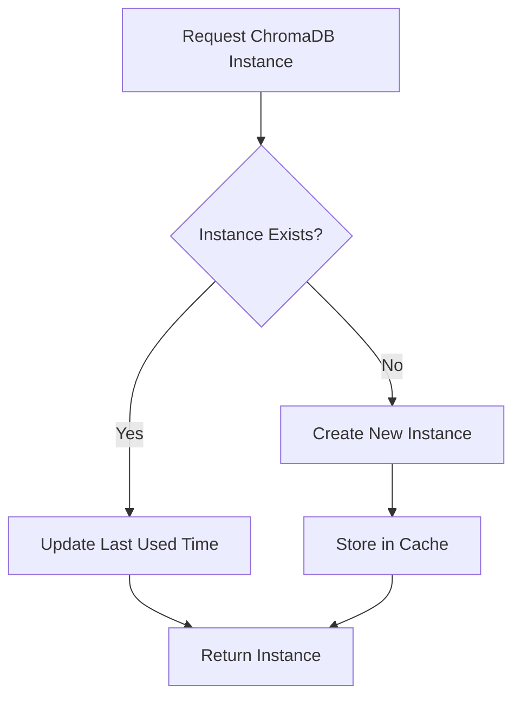

# ChromaDB Manager Implementation Guide

## Overview
ChromaDBManager is a singleton class that manages ChromaDB instances for vector storage in a RAG application. It handles thread-safe operations, instance caching, and cleanup.


### What is threading.Lock()?
threading.Lock() is a synchronization primitive that ensures thread-safe access to shared resources. It provides two main operations:
- `acquire()`: Obtain the lock
- `release()`: Release the lock


### Threading States Example
```python
# State 1: No threads holding the lock
_lock.locked() == False

# State 2: Thread A acquires lock
with _lock:
    # _lock.locked() == True
    # Only Thread A can execute this code
    client = chromadb.PersistentClient(...)

# State 3: Lock is released
_lock.locked() == False
```

### 1. Instance Management Flow

### 2. Key Operations

#### Collection Management
```python
# Example Usage:
chroma_manager = ChromaDBManager()
collection = chroma_manager.get_collection(
    file_id="doc123",
    embedding_type="azure",
    collection_name="rag_collection_doc123"
)

# Add embeddings
collection.add(
    documents=["document text"],
    embeddings=[[0.1, 0.2, ...]],
    metadatas=[{"source": "doc123"}],
    ids=["doc123_1"]
)
```

#### Instance Cleanup
```python
# Automatic cleanup after 4 hours of inactivity
def cleanup_old_instances(self):
    current_time = datetime.now()
    with self._instance_lock:
        for instance_key in list(self._instances.keys()):
            instance_data = self._instances[instance_key]
            if current_time - instance_data["last_used"] > self._cleanup_threshold:
                del self._instances[instance_key]
```

## Example Implementation

### 1. Basic Usage
```python
# Initialize manager
chroma_manager = ChromaDBManager()

# Get collection
collection = chroma_manager.get_collection(
    file_id="doc123",
    embedding_type="azure",
    collection_name="my_collection"
)

# Query collection
results = collection.query(
    query_embeddings=[[0.1, 0.2, ...]],
    n_results=3
)
```


## Integration Points


1. Background Tasks
```python
scheduler = BackgroundScheduler()
scheduler.add_job(
    chroma_manager.cleanup_old_instances,
    trigger="interval",
    hours=4
)
scheduler.start()
```
